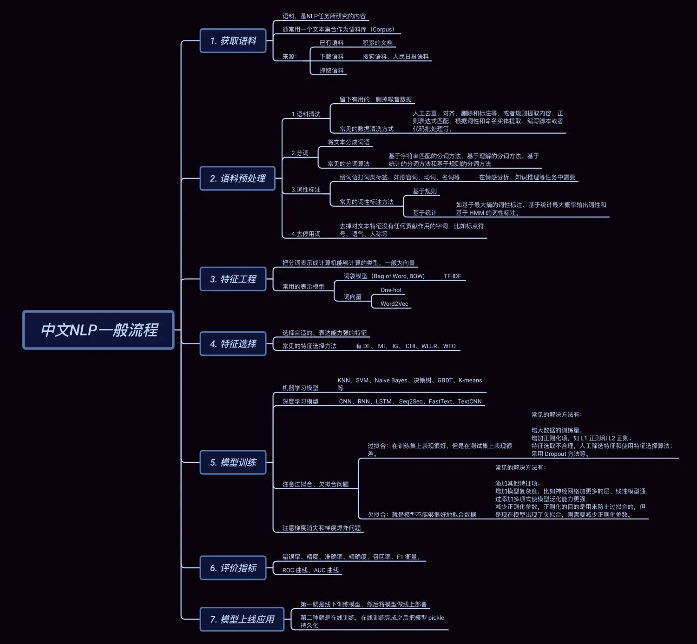

## NLP背景
- 自然语言处理 (Natural Language Processing) 是人工智能（AI）的一个子领域，是研究**人与人交互中以及在人与计算机交互中的语言问题**的一门学科。

 

- **图灵测试** 
    - **以对话形式来测试机器是否具有人工智能**，能理解人类的语言 
    - NLP让机器能够通过图灵测试
 

- **NLP Basic Tasks**
    - 词性标注
    - 命名实体识别
    - 共指消解，代词具体指代哪个实体
    - 依赖关系识别
    - 对于中文有特殊的分词方法，jieba

 

- **搜索引擎两大技术**
    - 匹配用户的query，计算query与所有文档document的**语义相似度**
    - 给定query之后，还可以返回广告，用户click后，广告商会向搜索引擎付费
    - 进行page rank，返回质量更高的
 

- **数据挖掘和信息检索**
    - 如何去分析一个网络的结构，**判断哪些节点更为重要**
 

- **潜在应用**
    - 知识图谱
    - 人工助手
        - 理解人类发出的指令，以及完成后进行恢复
    - 机器翻译
    - 情感分析和意见挖掘
