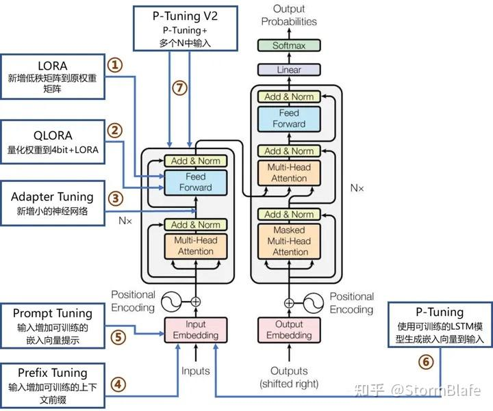
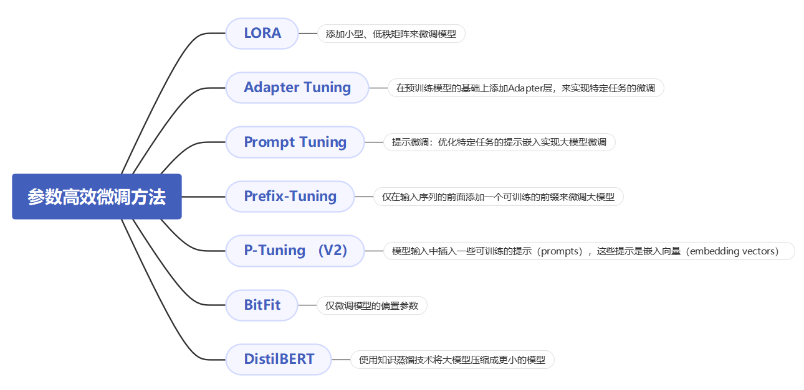
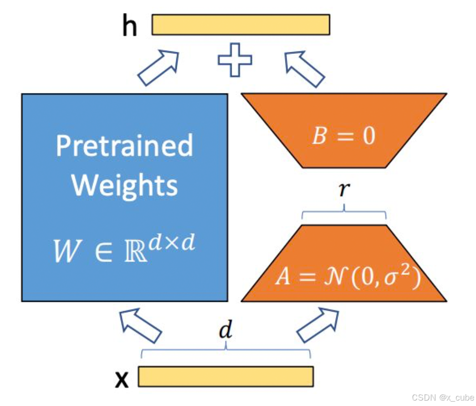
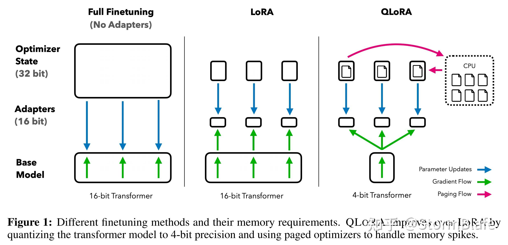
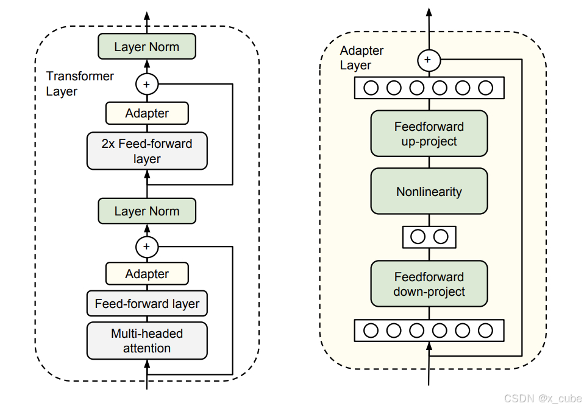
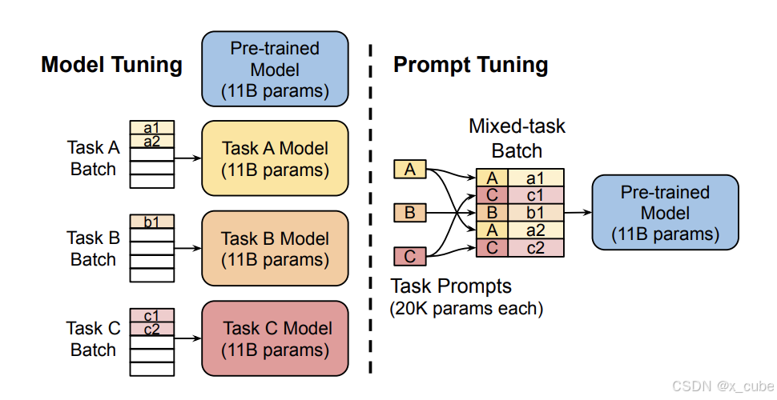
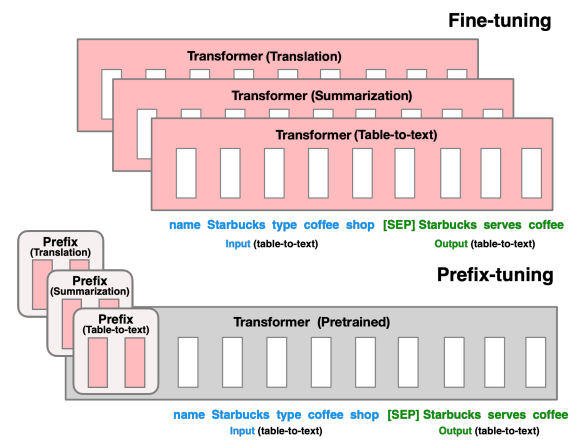
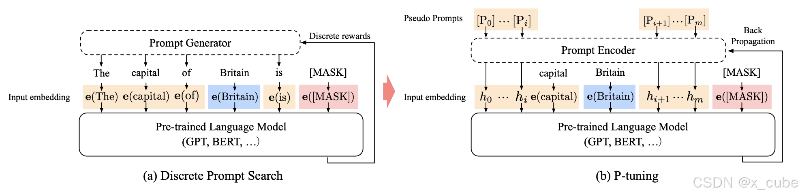
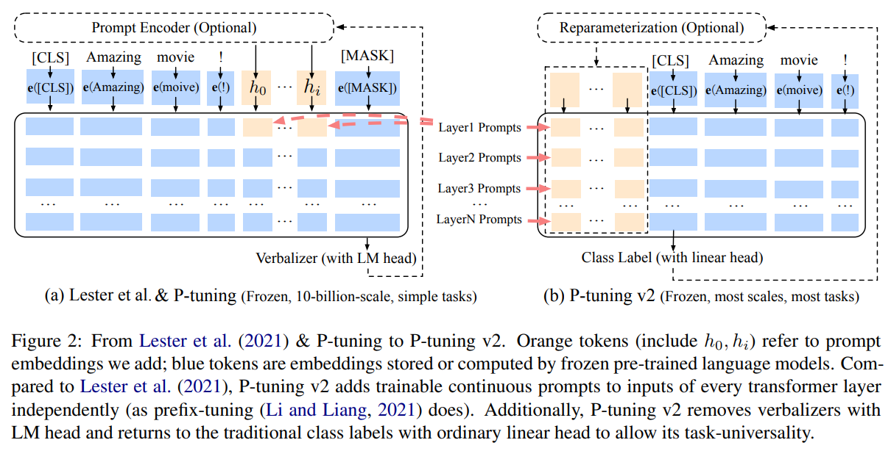

## PEFT (Parameter-Efficient Fine-Tuning) 
- 在面对特定的下游任务时，如果进行Full FineTuning(即对预训练模型中的所有参数都进行微调)，太过低效；而如果采用固定预训练模型的某些层，只微调接近下游任务的那几层参数，又难以达到较好的效果。
- PEFT是一种高效的微调方法，主要通过调整模型的一小部分参数来适应任务。它保留了原始模型的大部分知识，适合于资源受限的环境或多任务学习。

相比全参数微调，大部分的高效微调技术目前存在的两个问题:

1. 推理速度会变慢;

2. 模型精度会变差;

下面将介绍不同的参数高效微调方法，分为几类如下：

增加额外参数，如:Prefix Tuning、Prompt Tuning、Adapter Tuning及其变体。
选取一部分参数更新，如:BitFit。
引入重参数化，如:LoRA、AdaLoRA、QLoRA。
混合高效微调，如:MAM Adapter、UniPELT。

### 重参数化
#### 1. LoRA（Low-Rank Adaptation）低秩适应
- 核心思想是在模型的**关键层中添加小型、低秩的矩阵模块来调整模型的行为，而不是直接改变整个模型的结构**，这些模块与原始的权重矩阵进行加法操作，形成新的加权矩阵。

- 原理
    - 低秩矩阵分解： LoRA通过将权重矩阵分解为两个较低秩的矩阵来减少参数量。具体来说，**对于模型中的某个权重矩阵 W，LoRA将其表示为两个较小的矩阵 A 和 B，使得 W≈A×B**。从而以极小的参数量来实现大模型的间接训练。

    - 保持预训练权重不变： LoRA保留了预训练模型的原始权重，并在此基础上进行调整。**通过添加低秩更新矩阵 ΔW=A×B 到原始权重矩阵 W，来得到新的权重矩阵 W′=W+ΔW。** 这种方法允许模型在保留预训练知识的同时，适应新的任务。

- 流程
初始化：**A采用高斯分布初始化，B初始化为全0，保证训练开始时旁路为0矩阵;**

任务切换：**只要将lora部分替换即可，W0+B1A1换成W0+B2A2**。
预训练模型：使用传统的预训练模型（如 BERT、GPT 等）作为基础模型。

低秩矩阵引入：在原模型旁边增加一个旁路，通过低秩分解(先降维再升维)来模拟参数的更新量。

训练和微调：在微调过程中，仅调整低秩矩阵的参数A和B，而保留原始模型的权重不变。

推理：在推理阶段，将原始模型的权重加上经过微调的低秩矩阵BA，不引入额外的推理延迟。

- Rank 如何选取?

初步选择Rank在4-8之间最好，适用于大多数任务。训练并验证模型性能。若模型表现不佳，可以尝试增加秩值，例如 ( r = 16 ) 或 ( r = 32 )。如果模型过拟合或计算资源不足，可以尝试减小秩值。最后选择最优结果。

#### 2. QLoRA 相比LoRA进一步降低显存消耗
- QLoRA通过将模型量化到4位精度并使用分页优化器管理内存峰值来改进LoRA

4位NormalFloat量化：这是一种改进量化的方法。它确保每个量化仓中有相同数量的值。这避免了计算问题和异常值的错误
双量化：QLoRa的作者将其定义如下“对量化常量再次量化以节省额外内存的过程。”
统一内存分页：它依赖于NVIDIA统一内存管理，自动处理CPU和GPU之间的页到页传输，它可以保证GPU处理无错，特别是在GPU可能耗尽内存的情况下

#### 3. AdaLoRA (Adaptive Low-Rank Adaptation)
在 LoRA 的基础上引入自适应机制，根据数据或模型的表现动态**调整低秩矩阵的秩和学习率**。
工作原理：通过自适应调整低秩矩阵的配置，使得参数调整更加灵活和高效。可以根据模型在训练过程中的表现动态优化低秩矩阵的参数。

### 部分参数更新
#### 1. BitFit
- 核心思想
    - **仅对模型的偏置（bias）参数进行微调，而不是更新整个模型的权重。** 通过这种方式，BitFit 旨在减少训练开销，同时保留预训练模型的大部分原始知识，使其适应新的任务或数据。
- 原理
    - 原始 BERT 模型：包含多层 Transformer，每层有权重矩阵 W 和偏置 b。
    - BitFit 微调：保持所有权重矩阵 W 不变，只微调每层的偏置参数 b

### 增加额外参数
#### 1. Adapter-Tuning
- 通过**在预训练模型的基础上添加适配器层**（adapters），来实现特定任务的微调。这种方法旨在保留预训练模型的原始权重，仅在需要适应新任务的地方进行小规模的参数调整。

- 适配器层结构
    - 这些适配器层是一些小规模的神经网络，通常由一个下采样层down-project（减少维度）、一个非线形层（激活函数）和一个上采样层up-project（恢复高维度）组成；同时也设计了 skip-connection 结构，确保了在最差的情况下能够退化为 identity)，并将其嵌入 Transformer 的结构里面;

- 流程
    - 冻结预训练权重： 在微调过程中，预训练模型的原始权重保持不变，**仅训练适配器层的权重。**

    - 高效微调：**由于适配器层的参数数量相对较少，微调过程变得更加高效**。
    
    - **适配器层可以针对不同任务进行训练，而不影响预训练模型的核心结构。**

#### 2. Prompt-Tuning
- 在预训练语言模型的**输入中添加可学习的嵌入向量作为提示**。其核心思想是通过**引入任务特定的提示（prompts），而非对整个模型进行全参数更新**，从而实现对模型的高效微调

- **模型调优需要为每个下游任务制作整个预训练模型的任务特定副本**，并且推理必须在不同的批次中进行。**提示调优只需要为每个任务存储一个小的任务特定提示，并允许使用原始预训练模型进行混合任务推理。** 对于一个 T5 “XXL” 模型，每个调优后的模型副本需要 110 亿个参数。相比之下，我们的调优提示每个任务只需 20,480 个参数——减少了超过五个数量级——**假设提示长度为 5 个标记。**

- 原理
设计提示词： 输入提示（prompt）通常包含任务描述、示例或特定的输入格式。例如，对于情感分类任务，可以设计一个提示词：“这段文字的情感是：”。

优化提示词： **Prompt Tuning 的优化对象是输入提示的词嵌入（embedding）**。通过梯度下降等优化算法，调整提示词的词嵌入，使得模型在特定任务上的表现达到最优。

冻结预训练模型： 在 Prompt Tuning 中，**预训练模型的权重保持不变，仅优化提示词的嵌入**。

#### 3. Prefix-Tuning
- 通过固定预训练模型的参数，**仅在输入序列的前面添加一个可训练的前缀（prefix）**，从而在不改变模型参数的情况下实现特定任务的适应

微调（顶部）会更新所有 Transformer 参数（红色的 Transformer 框），并且需要为每个任务存储一个完整的模型副本。我们提出了前缀微调（底部），它冻结了 Transformer 参数，仅优化前缀（红色的前缀块）。因此，我们只需要为每个任务存储前缀，使得前缀微调具有模块化和节省空间的优点。请注意，每个垂直块表示在一个时间步的 Transformer 激活状态。

- 原理
固定模型参数： 不对预训练语言模型（如 GPT-3、BERT 等）的参数进行微调

添加可训练前缀： 在输入序列的前面添加一个可训练的前缀向量。这个前缀向量的长度和维度可以根据具体任务进行调整

任务适应： 在实际应用中，前缀向量与输入序列一起输入到预训练模型中。**由于前缀向量是可训练的，模型可以通过调整前缀向量来适应特定的任务，而无需改变模型本身的参数。**

#### 4. P-Tuning

