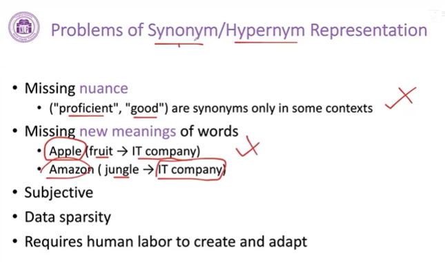

## 词表示
### 1. 目标
- 进行词之间的**相似度计算**
- 发现词之间的**语义关系**
 

### 2. WordNet
- **使用一系列相关的词来表示当前词**

- **方法的弊端**

 

### 3. one hot 向量
- **在和词表一样长的向量中去找一维和每个词相对应，任何一个词只有在他对应的维度上值为1，其他维度为零的向量表示**
    - 比较好地去**计算两个文档之间的相似度计算**，把文档拥有的词相应的维度非0
    - 而**任意两个词之间去计算相似度都是零**，因为向量正交

 

- represent word by context
    - 利用词的上下文的词来表示这个词
    
    - s使用上下文出现的频度或重要性去表示，得到一个稠密向量
    
    
 

- **Word Embedding**   
    - **分布式表示**
    - **建立一个低维的稠密的向量空间，把每一个词都学习到这个空间里面，用空间的某一个位置所对应的向量来表示这个词**
    - Word2Vec
    
