## Language Model
### 1. 定义
- **有能力根据前文来预测下一个词是什么**
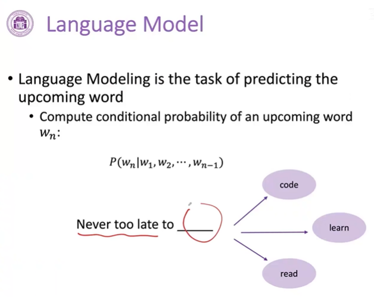
 

- **两大能力**
    - **联合概率：** 计算一个词的序列成为合法的一句话的概率
    - **条件概率：** 根据前文来预测下一个词
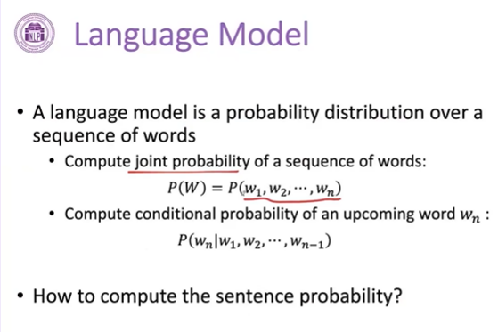
 

### 2. 语言模型的假设
- **一个未来的词只会受到前面的词的影响**，故可以将联合概率拆解成一个个条件概率
- 由此得到**语言模型的写法**，**一个句子的联合概率等于里面的每一个词基于他前面已经出现的词的条件概率之积**
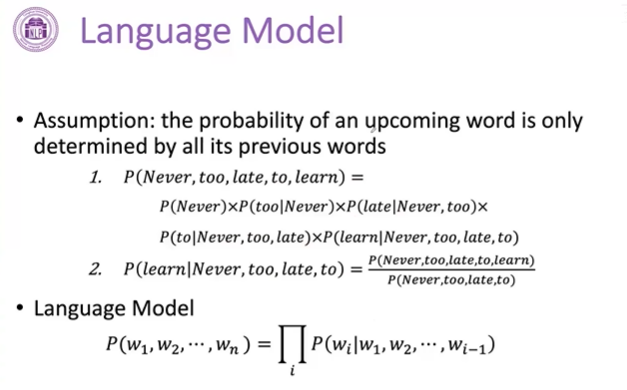
 

### 3. 如何构建语言模型
- **N-gram 统计语言模型**
    - N代表的是**统计长度为 N 的词在语料库里面出现的频度，当前词也算一个**
    - 比如4-gram，前面出现了三个词，看后面出现的词的频度多大。**到一个大规模的数据中进行统计不同 4-gram(too late to learn, too late to code .etc) 的频度，使用这个频度来估计下一个单词出现的概率**
    - **缺点是需要存储所有可能的 n-gram**
    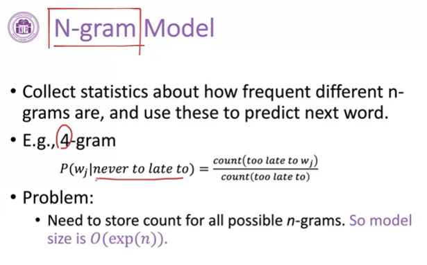

    - **Markov assumption**
        - n-gram 基于 Markov assumption
        - **联合概率只考虑前面的有限的 k 个词，不考虑超过范围的词**
        - N=2时，就只考虑预测词的前一个词，例如learn的话，就只考虑to
        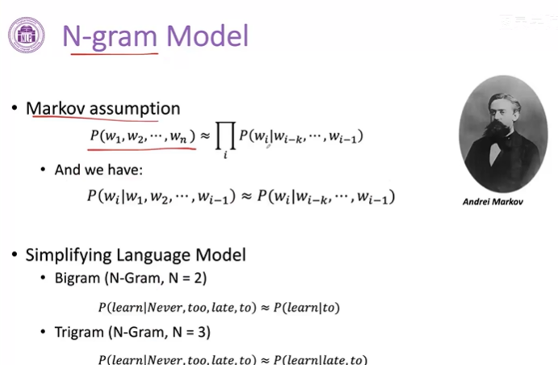  

    - **缺陷**
        - N越大，在整个语料库统计的时候，出现的频度会越少，统计结果稀疏
        - N越大，存储量越大
        - 无法捕捉词之间的相似度 
        - 每个词还是一个符号
        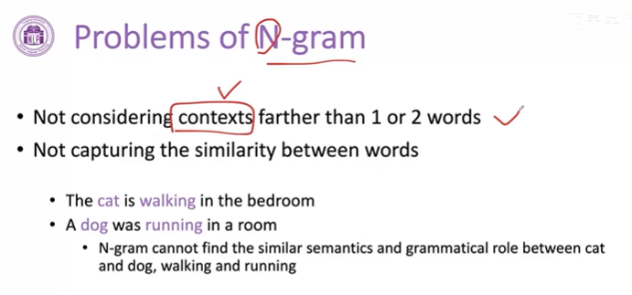
 

- **Neural LM 神经语言模型**
    - Word2Vec
    - **学习词的分布式表示来建构前文和当前词的条件概率**
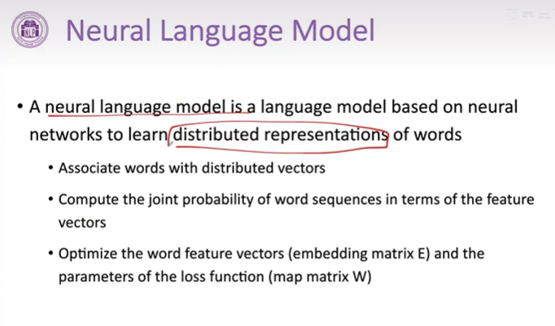
    - **首先将前文的词表示成一个低维的向量，将低维的向量拼接在一起形成一个更高的上下文向量，然后经过一个非线性转化得到标量值，最后经过 softmax 转化为概率分布，从而预测下一个词**
    - 每个词的向量以及匹配预测的过程可以基于神经网络的可调的可学习的参数完成，故可以使用大规模数据自动地学习这些向量
    - 与N-gram不同，每个词都表示成一个低维的向量，**相似的词，其向量也会比较相似**

 

- **Pre-trained LM 预训练语言模型**
    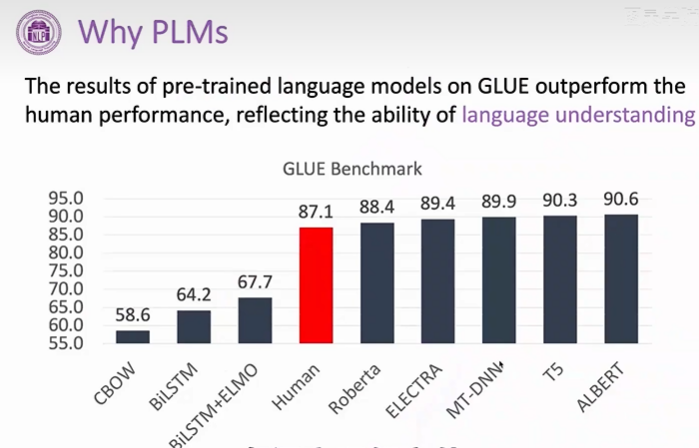
    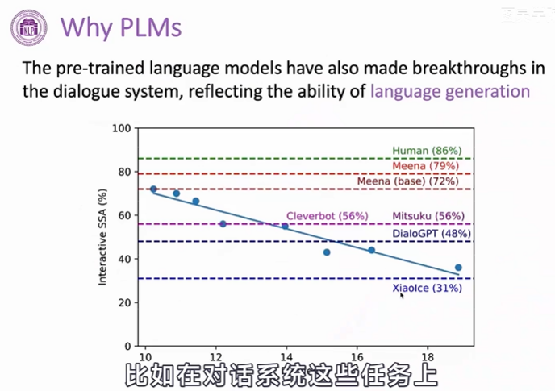
    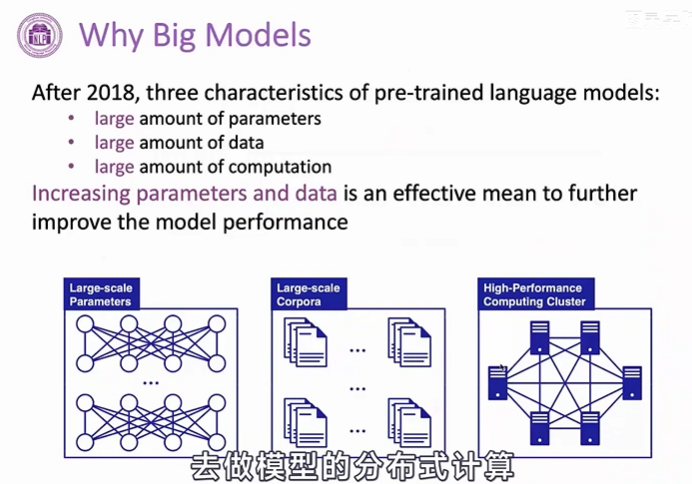
    - **PLM从无标注的数据中进行学习，通过自监督的一些任务去做预训练，从中获取丰富的通用知识**。在具体的应用时，会引入一些具体任务相关的数据去调整模型的参数（fine-tuning），对具体任务进行适配，在下游任务表现好
    - **预训练模型使用范式**
    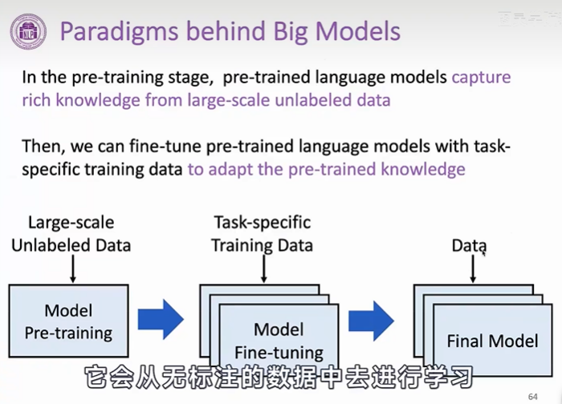
    - **迁移学习**
        - 使用先前学习到的知识来更快地解决新问题
    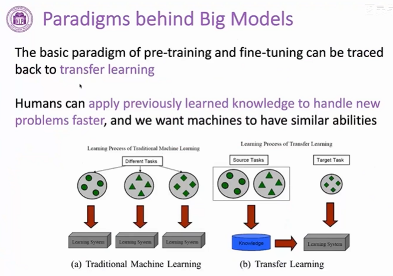

### 4. 监督学习 vs 无监督学习
- 有监督和无监督最主要的区别在于**模型在训练时是否需要人工标注的标签信息**
- **监督学习**
    - **利用大量的标注数据来训练模型**，模型的预测和数据的真实标签产生损失后进行反向传播（计算梯度、更新参数），通过不断的学习，最终可以获得识别新样本的能力。

- **无监督学习**
    - **不依赖任何标签值**，通过对数据内在特征的挖掘，找到样本间的关系，比如聚类相关的任务。无监督学习中被广泛采用的方式是**自动编码器**（autoencoder）

    - 所谓自编码器（Autoencoder，AE），就是一种**利用反向传播算法使得输出值等于输入值的神经网络，它先将输入压缩成潜在空间表征，然后将这种压缩后的空间表征重构为输出**。
    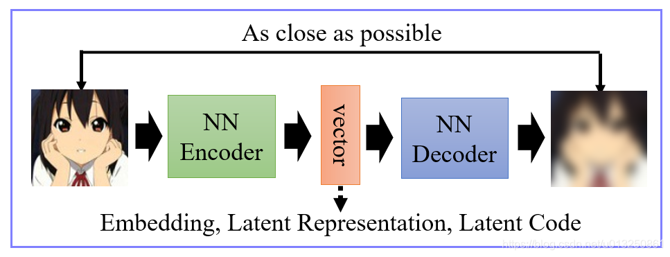

- **自监督学习**
    - 主要是**利用辅助任务（pretext）从大规模的无监督数据中挖掘自身的监督信息，通过这种构造的监督信息对网络进行训练**，从而可以学习到对下游任务有价值的表征。
    - 自监督的 Pretrain - Finetune 流程：首先从大量的无标签数据中通过 pretext 来训练网络（自动在数据中构造监督信息），得到预训练的模型，然后对于新的下游任务，和监督学习一样，迁移学习到的参数后微调即可。所以自监督学习的能力主要由下游任务的性能来体现。
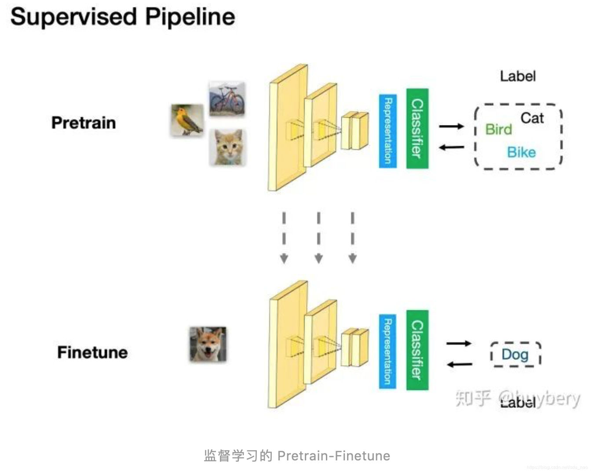
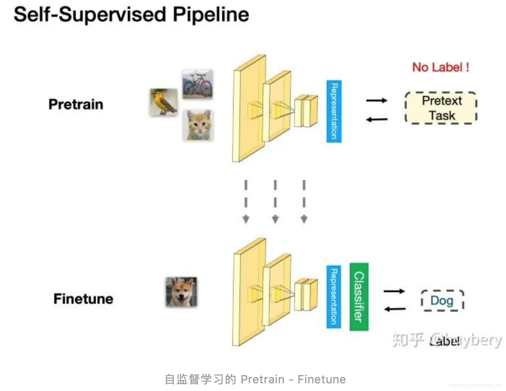