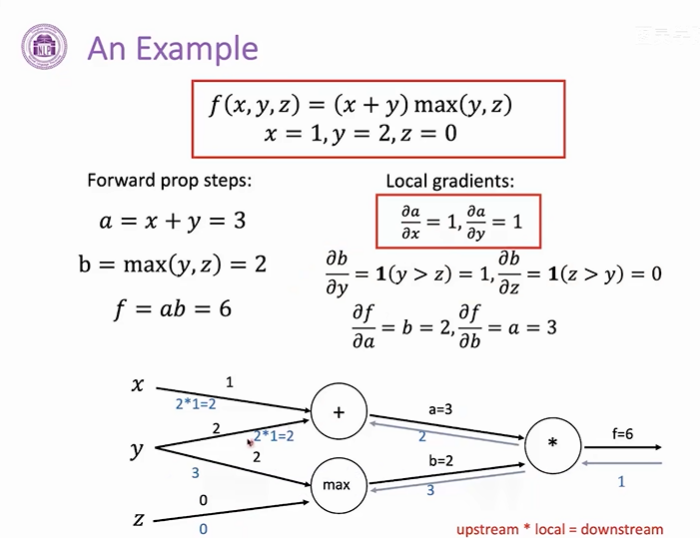

## 神经网络基础
### 1. 神经元模型
- **为输入添加了一个维度，这个维度的输入恒定为1，那么就可以把边的权重写为b，这样偏置的计算就可以与其他输入的计算进行统一**
- w，x粗体表示向量，维度相同，将w转置与x相乘得到一个**标量**

- **单层神经网络**
    - 三个神经元

    - 并行计算
    - 矩阵计算
    - 激活函数f对一个向量进行按位运算，对向量每一个值进行运算  

- 多层

- 前向传播

- **为什么需要非线性激活函数**
    - 如果没有的话，每一层的操作只是对上一层的输出应用一个线性变换
    - 两层网络可以表示为一层，权重是w2w1，偏置是w2b1+b2
    - 如果神经网络只存在线性运算，那么多层神经网络其实可以转化为单层的，其表达能力是一致的，所以需要引入非线性函数，防止多层网络塌缩成一层，增加表达能力来拟合更复杂的函数

- 输出层

- 线性变换可以进行维度转换
    - 线性输出层：直接在隐层后面再加一个线性层得到输出，适用于回归问题，预测一个具体的值 通过不断的训练我们最终得到一个函数映射，给定函数(网络)一个输入，函数(网络)会给出相应输出，若输出的是一个数值(scatter)，我们可以将这一类机器学习的问题称为回归问题
    - sigmoid：先使用一个普通线性层得到一个值，再使用sigmoid函数将输出控制在[0,1]范围，可以用于解决二分类的问题，用y来表示模型预测当前输入属于莫一类的概率，1-y就表示当前输入属于另一类的概率

    - softmax：解决多分类(>2)的问题，几个分类就设置几个输出，首先还是对最后一个隐层去应用一个普通的线性层得到z，将最后一个隐层变成我们想要的维度，最终得到一个不同类别的概率分布
    

- 训练过程
    - 回归问题，神经网络根据输入数据拟合一个具体的值，降低均方差作为训练目标
    - 减小损失函数的值
    
    - 交叉熵衡量模型正确分类的概率
    
    - softmax得到概率分布，损失函数值越小，相应正确类别的预测概率越大
    
    - 损失函数对于参数的梯度代表了对这个参数进行单位大小的改动，损失函数变化最快的一个方向，因为我们需要降低损失函数的值，所以更新参数要沿着梯度的反方向，添加负号
    

    - 梯度
    - 函数F有n个输入，最后产生一个标量的输出，可以对应到神经网络中计算损失函数的步骤
    - 在计算损失函数时，此时的输入可能有模型的输出以及真实的标签
    - 对输入求梯度
    
    - 对应有m个神经元构成了一层网络，将m个输出对n个输入求微分
    

- 链式法则
    - W是矩阵，其他加粗的是向量，将两个jocobian矩阵相乘

    - 激活函数f是独立应用到向量z的每一个维度，h对z的微分就是对角矩阵
    - z对b求微分是单位矩阵I
    

- 反向传播
    - 计算图
    
    
    - 下游梯度 = 上游梯度 * 本地梯度
    
    - 先计算本地梯度
    
    
    