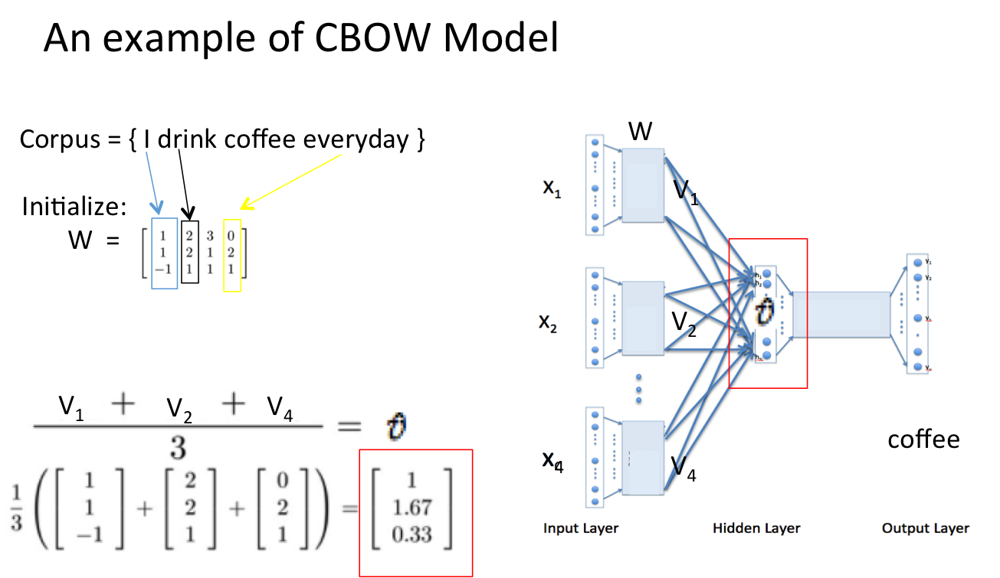
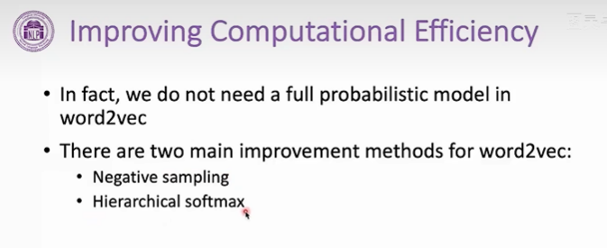

## Word Embedding 词向量 
### 1. 目标
- **Word2Vec 的最终目的不是为了得到一个语言模型，而是只关心模型训练完后的副产物**：模型参数(这里特指神经网络的权重)，并将**这些参数作为输入 x 的某种向量化的表示（分布式表示），这个向量便叫做——词向量**
- **Word2Vec 可以学习词的语义内涵，从而捕捉到语言学上的一些规律**

 

- How to get the word embedding 

- 假设我们此时得到的概率分布已经达到了设定的迭代次数，那么现在我们训练出来的look up table应该为**矩阵W**。即，**任何一个单词的one-hot表示乘以这个矩阵W都将得到自己的word embedding。**

### 2. 两种训练模型
- **滑动窗口**
    - 最中间的词是 target，其他词是 context
    - **CBOW 根据 context 预测 target**
    - **skip-gram 根据 target 预测若干个 context**
     
    

- **CBOW**
    - **不考虑context的次序**
    
    - **将never和late表示为one-hot向量（词表维度），进行average得到新向量**，这个向量的大小仍旧是词表维度，**为了让模型去预测出这个词too，我们需要设计成一个n分类问题，n表示词典的大小，每个词代表一个类别**，需要对网络输出层进行设计。
    - 这里**通过线性变换将词向量大小维度的向量转化为词典大小**，再softmax，得到词典大小的概率分布的向量
    

- **skip-gram**
    - 将问题分解成**让target分别去输出每一个context**
    
    

### 3. Full-Softmax problem
- 之前都是对整个词典维度的向量进行softmax，再计算**交叉熵损失（衡量模型正确分类的概率）进行反向传播，会导致计算量很大**

### 4. 解决方法

- **负采样**
    - **不是predict的词称为负例，不把整个词表(除predict之外的)作为负例，只采样一小部分作为负例，对采样的部分以及要predict词做softmax，而不是对整个词表softmax**
    - 按照词的频率进行负例采样，**频率越高，被采样的概率越大**
    - 3/4次方经验值，可以**让低频词被采样的概率稍微提高一些**
    
    - 举例：在softmax之前，我们只采样四个不是我们要预测的context的词，softmax只有五个数
    
    - 原本是要对300 * 10000矩阵进行梯度计算，使用负例采样之后，反向传播的时候只对300 * 5这个子矩阵求梯度
    

- **分层softmax**

- other tips
- 使用sub-sampling去掉一些出现频次搞的词

- 滑动窗口大小可变，更近的context词比更远的与中间的target更加相关
- 设置一个Smax，生成训练数据时，从1到smax采样一个值，作为当前的大小
- 这样离target更近的词更有可能被采样成context词
