## RNN VS CNN
### 1. RNN基础
- 处理序列数据时会进行一个顺序的记忆
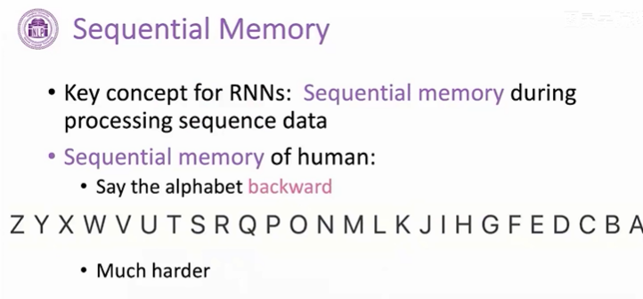
- 顺序记忆更容易识别序列模式的数据的机制
- RNN利用这个机制递归地更新顺序记忆，来对序列数据更好地建模
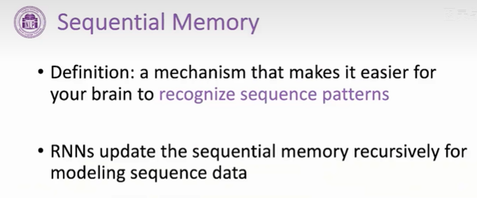
- h0, h1，..表示不同时间步下的一个状态变量，存储过去以及当前输入的信息
- 时间步不一定是寻常意义的时间，而是表示具有前后顺序的一个变量

- hi由上一个时间步的hi-1和当前输入计算得到
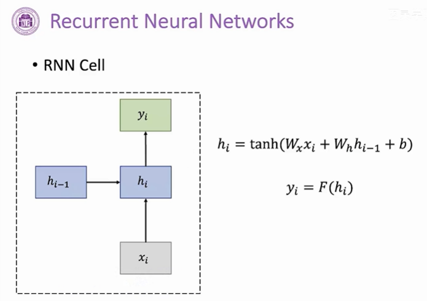
- 首先获取never的one-hot向量，然后经过预处理获得其词向量，转化为一个语义更加丰富的向量，h0是随机初始化的
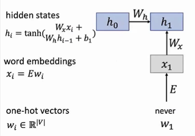
- h4包含了前面四个词的所有信息，可能会对句子的语义具有很好的把握，得到h4向量后经过一个线性层，再通过一个softmax，输出此表上每个词的概率，选择概率最大的
- 可以看到wh和wx矩阵都是一样的，整个rnn结构都是每一个rnn单元不断复制得到的，每个rnn单元功能是相同的，可以很好实现参数共享。有助于模型泛化到不同长度的样本，同时节省参数量。参数量和序列数据是无关的
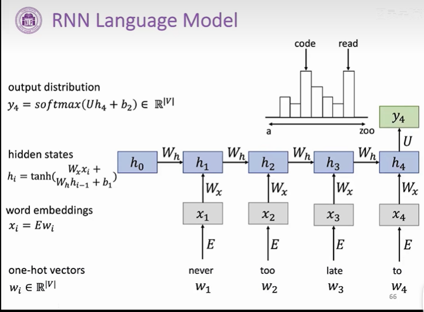

- 优缺点
- 可以处理变长的数据，而且模型的大小参数量，不会随着输入的增大而增大，参数共享
- 后面的计算可以使用到之前的序列信息
- 训练时间比较慢，顺序的计算
- 随着时间步不停往后推移，后面一些单元的计算很难获取之前的信息
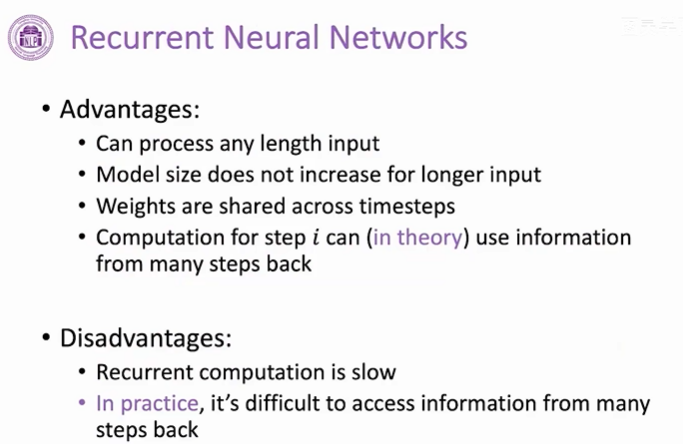
- 当第n层状态变量与第n-1层状态变量的偏导大于1，梯度呈指数型增长，梯度爆炸
- 小于1，呈现指数型衰减，梯度消失
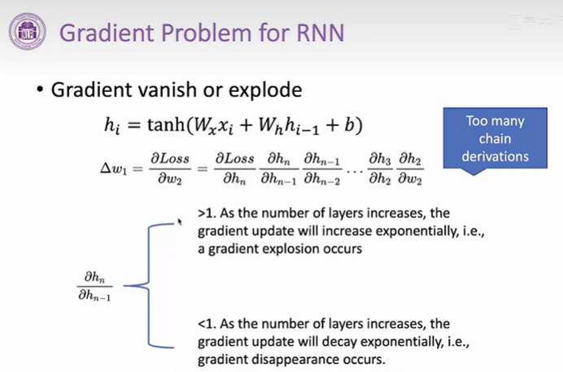
- 在计算的时候保存当前周围的记忆来捕捉到长距离的依赖性
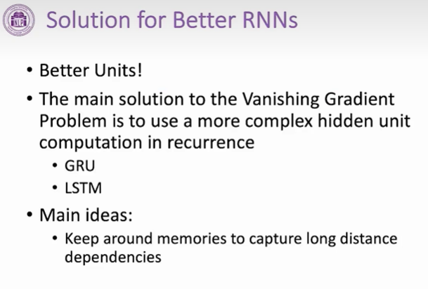

### 2. RNN 变体
- **GRU**
    - 将门控机制引入到RNN，门控机制就是对当前输入的信息进行筛选，类似们，决定哪些信息会传递到下一层
    - 更新们和重置门，权衡过去的信息hi-1和当前输入信息的比重问题
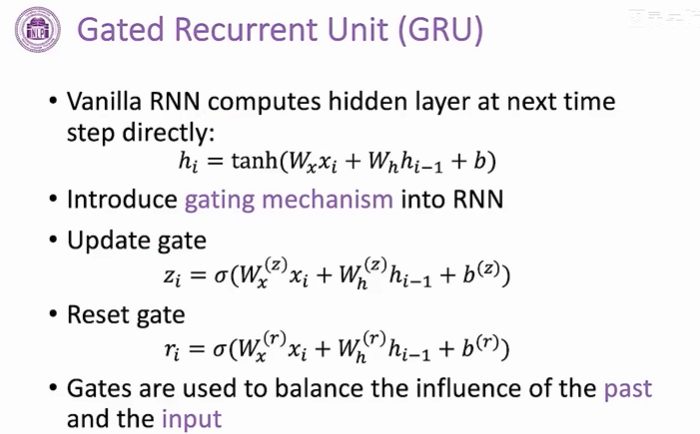
    - 两个门拥有自己专属的权重，重置们ri获得一个新的临时的激活值~hi，更新们zi则权衡当前得到的新的激活值和过去状态的之间的影响，得到hi
    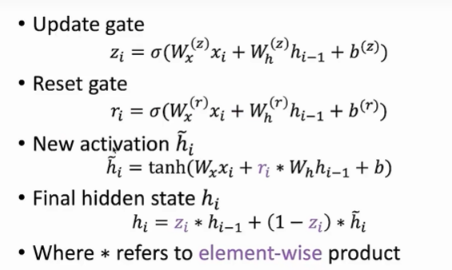
    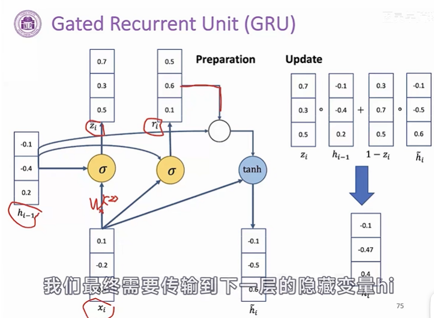
    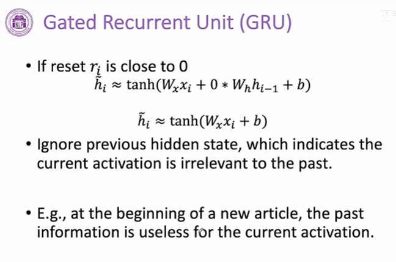
    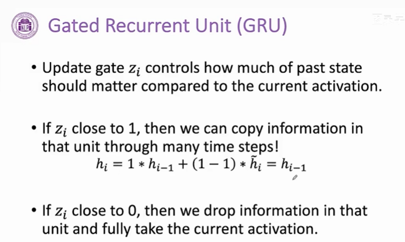

- **LSTM** 遗忘门 输入门 输出门
    - **LSTM更好地处理序列中的长期依赖关系**
    - Ct是细胞状态（记忆状态）， 是输入的信息， 是隐藏状态（基于 得到的）
    - 用最朴素的语言解释一下三个门，并且用两门考试来形象的解释一下LSTM：

    - 遗忘门：通过x和ht的操作，并经过sigmoid函数，得到0~1的向量，0对应的就代表之前的记忆某一部分要忘记，1对应的就代表之前的记忆需要留下的部分 ===>代表复习上一门线性代数所包含的记忆，通过遗忘门，忘记掉和下一门高等数学无关的内容（比如矩阵的秩）
    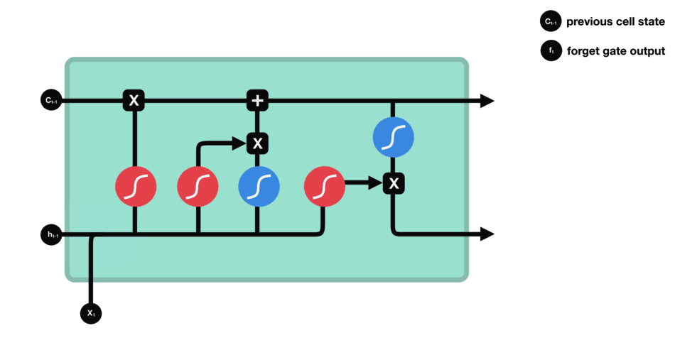

    - 输入门：通过将之前的需要留下的信息和现在需要记住的信息相加，也就是得到了新的记忆状态。===>代表复习下一门科目高等数学的时候输入的一些记忆（比如洛必达法则等等），那么已经线性代数残余且和高数相关的部分（比如数学运算）+高数的知识=新的记忆状态
    
    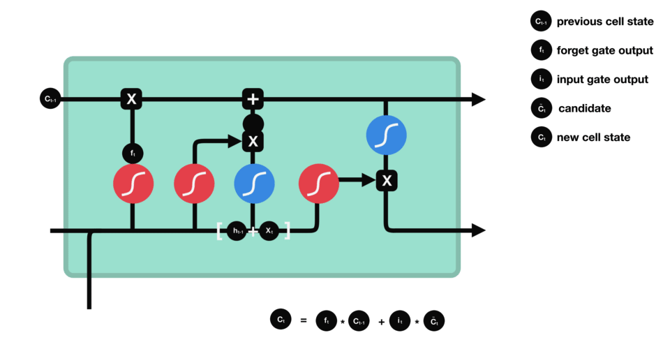

    - 输出门：整合，得到一个输出===>代表高数所需要的记忆，但是在实际的考试不一定全都发挥出来考到100分。因此，则代表实际的考试分数
    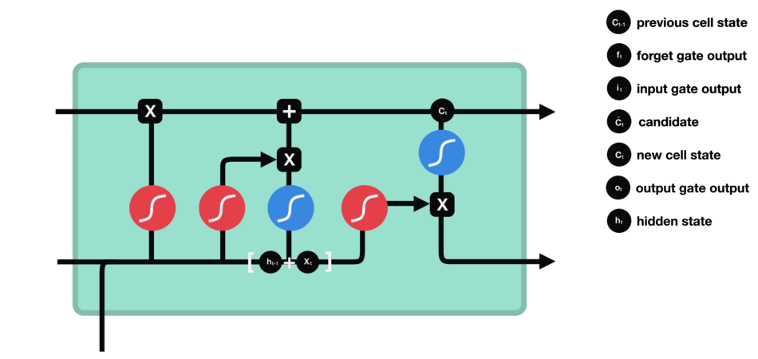

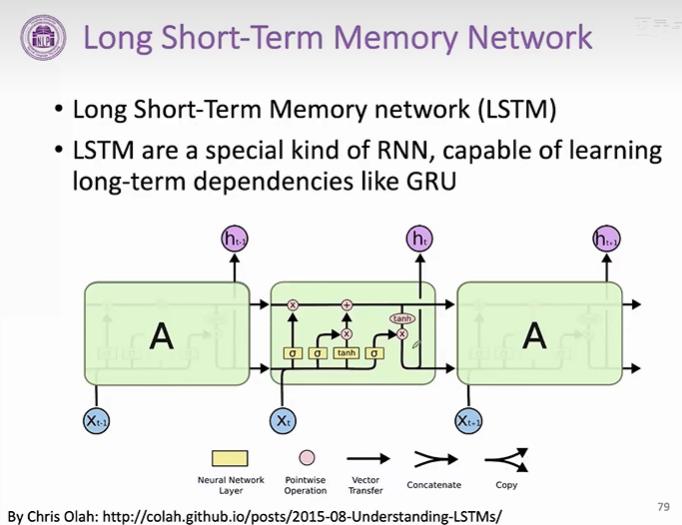
    - cell state来捕捉长期依赖关系，进行微小的线性之间的相互操作，通过门控系统很容易移除或者添加信息到cell state，信息传播更容易
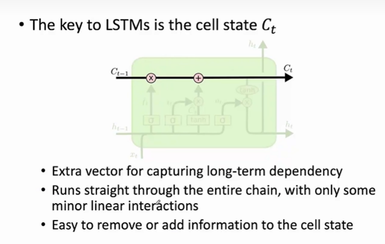
    - 遗忘门，上一个状态Ct-1有哪些信息可以从cell状态中移除，ht-1和xt进行连接，如果为0，直接丢弃过去的信息
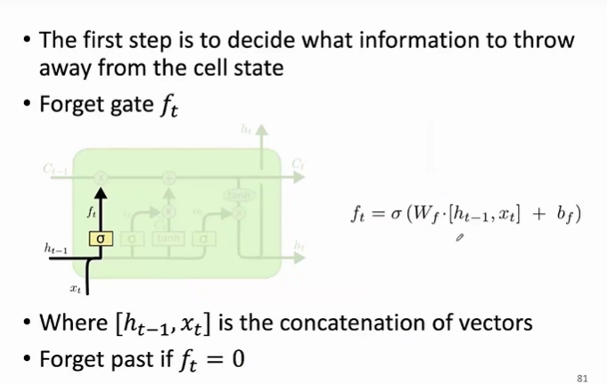
    - 输入门，决定有哪些信息可以存入到cell里面，决定待选cell state有哪些部分存入到cell状态中 
    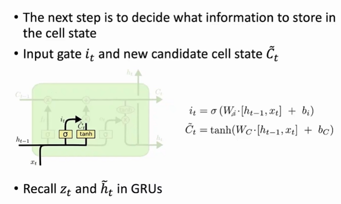
    - 更新cell状态，首先对之前状态的信息Ct-1进行一个筛选（遗忘门ft），然后决定哪些信息需要加入到cell状态中，最终得到Ct
    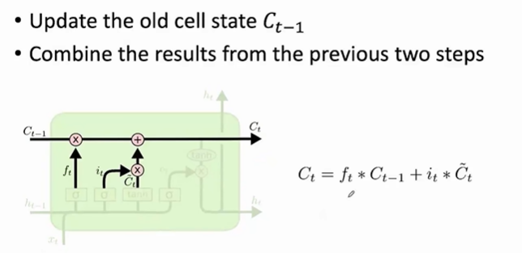
    - 输出门 决定哪些信息可以输出，计算新的ht，可以理解为调整一些句子信息来适应一些特定单词的表述
    
    - 优缺点
    - 每个隐藏层都是已经有一个深度的内部神经网络计算好了，在做堆叠的时候（网络很深）性能表现好
    - 引入了门控机制，对输入和输出动态控制，增强对信息的利用能力
    - 有效缓解梯度的问题
    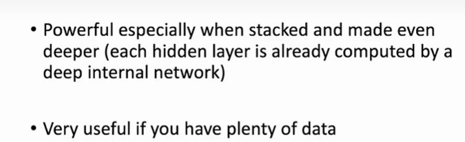
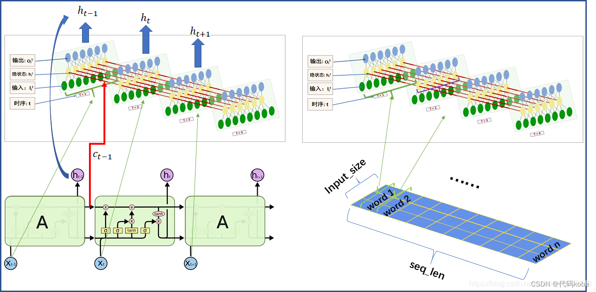

- 双向RNN Bidirectional RNNS
    - 传统RNN都是从过去状态和当前输入来捕获信息的，有些时候，计算当前状态的时候不只是依赖过去，还可能依赖未来的输入，相当于依赖整个序列
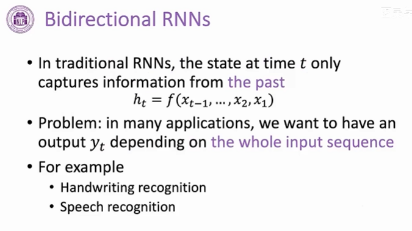
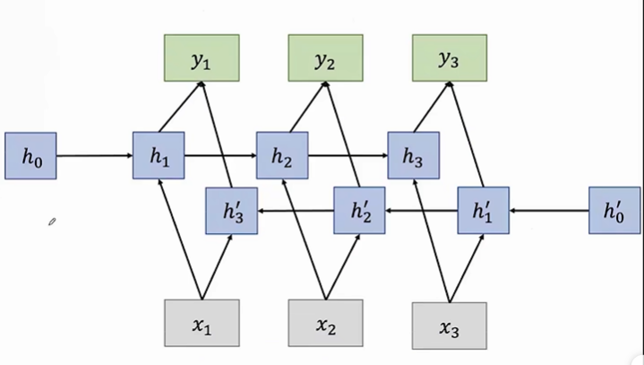
    - 顺序记忆
    - 梯度问题
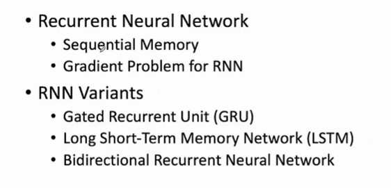

- CNN
    - CNN擅长提取局部和位置不变的模式
    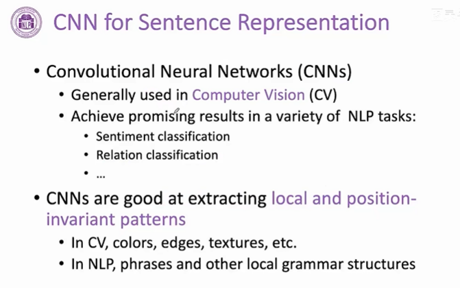
    - 计算一个句子中所有可能的n元组短语（选取相邻的n个词作为短语）的一个表示
    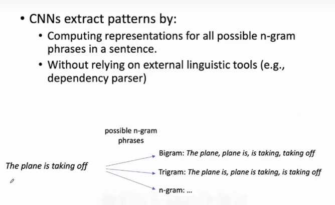
    - 结构
    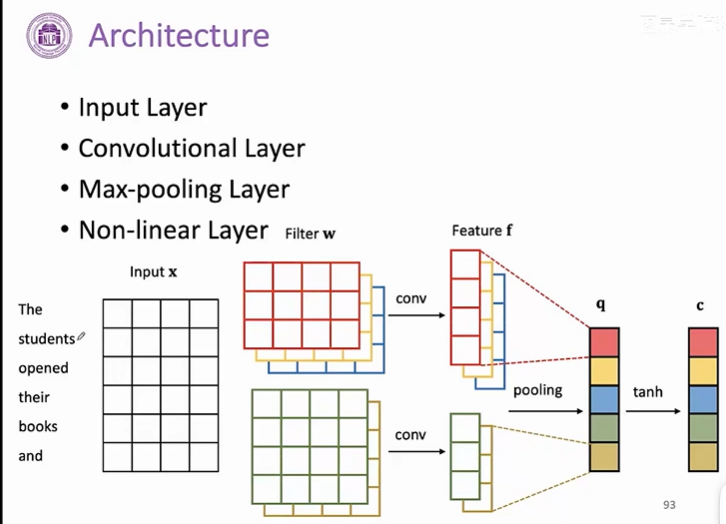
    - 输入层 将输入的词转化为向量表示
    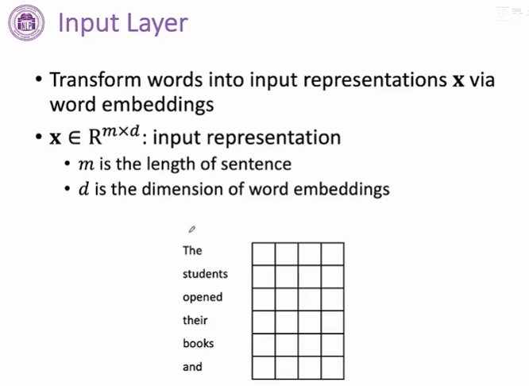
    - 卷积计算
    
    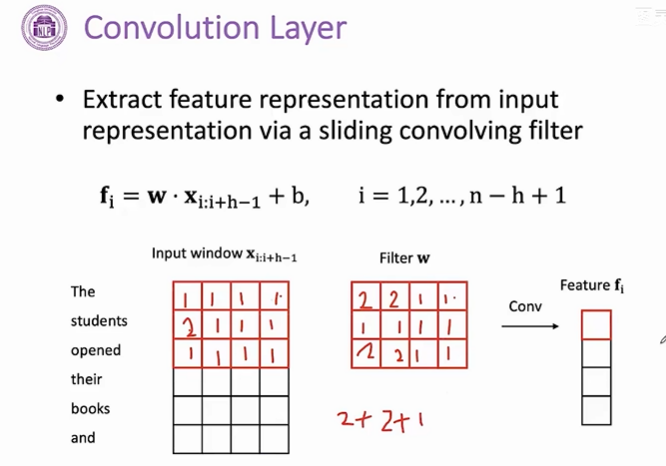
    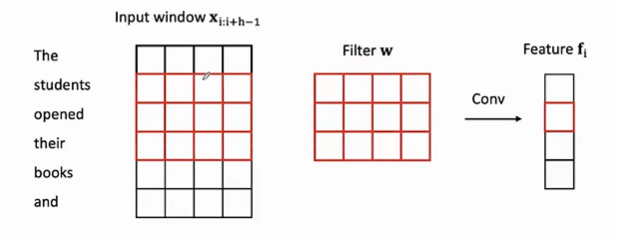
    - 文本分类
    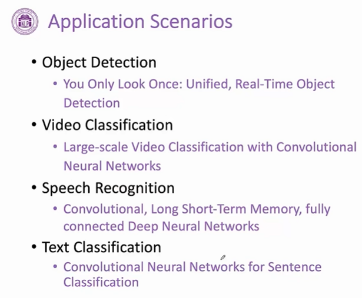
    - cnn vs rnn
    - cnn擅长提取局部特征，RNN可以很好处理变长文本，对变长文本依赖进行很好的建模
    - cnn的卷积核在计算时，之间没有相互依赖，可以实现并行化计算
    - RNN有很强的数据前后的依赖关系，不能并行化运算 ---> transformer
    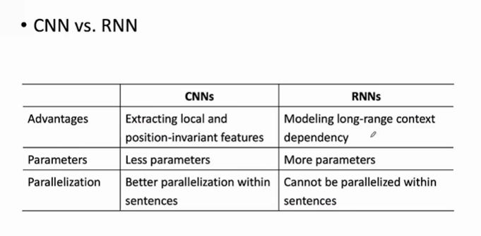