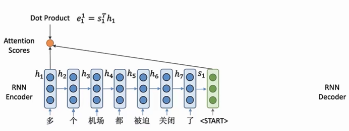

## Attention 机制
### 1. the souce of Attention
- **Seq2Seq 存在信息瓶颈的问题**

- **decoder端需要从encoder端最后得到的一个向量表示来输出一个完整的句子，那就要求这个向量需要包含输入句子的所有信息。这个向量容量会显著限制模型encoder端的表示，这个向量就是encoder和decoder模型间的信息瓶颈**
- **注意力就是来解决信息瓶颈的**。
    - 核心：**在decoder的每一步都把encoder的所有状态向量提供给decode模型，decoder根据自己当前的状态，自动选择使用的信息和向量。attention其实就是一个动态选择状态向量hi的过程**

### 2. 具体过程
- 不用s1来直接计算单词生成的概率，而是**用s1来选择关注输入句子中的哪些部分**
- 首先需要**计算注意力分数**，将s1与h1..h7点积(维度相同)得到一个**标量**e1..e7(注意力分数)，这个**表示s1和encoder端每一个hi的相似程度**

- 得到了注意力分数，**需要使用softmax将其变为概率分布（注意力分布），注意力分数越大，对应的概率就越大，decoder端会更加关注这些位置的向量**

- 利用得到的**注意力分布对encoder端的隐向量进行加权求和，得到o1，这个向量包含了decoder端当前所需要的encoder端的所有信息**

- **将o1与s1进行拼接得到一个新向量，表示decoder端这一步的一个状态，根据这个向量来预测下一个生成的单词**

### 3. 公式化

- **attention的本质就是计算value向量的加权求和，动态选择value的过程**

### 4. Attention Variants
- **如果s和h维度不一样，需要在中间加上一个权重矩阵**

- **FFN将两个向量变成一个标量来得到注意力分数**，而不是通过点积

### 5. Attention contribution
- attention是为了**解决信息瓶颈**的问题，通过attention机制**decoder端在每次生成的时候都可以直接关注到encoder端所有位置的信息**
- **有效缓解了梯度消失**的问题，提供了**一种encoder和decoder端直接连接**的方式，防止梯度在rnn中传播过长而导致梯度消失的问题
- 为神经网络的黑匣子模型提共了**一定的可解释性**，捕捉到了**语义的对齐关系**
