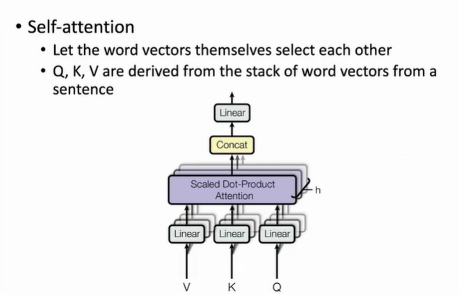

## Transformer
### 1. Motivation
- **RNN 致命的缺点在于必须需要顺序地执行，并且需要attention来解决信息瓶颈的问题**

### 2. Transformer 结构
- 整体还是**encoder-decoder结构**
- **输入层**
    - 将正常文本序列通过BPE切成一个个小的单元token，再通过embedding转化为一个向量表示，每个向量会加上一个位置向量，表示在文本序列的位置

- **通过堆叠的方式得到一个更深、表达能力更强的模型**

- **输出层**
    - 通过**一个线性变换加上sortmax输出一个在词表上的概率分布**，与RNN相同

- **训练过程**
    - **在词表维度的概率计算交叉熵损失更新模型参数**

### 2. 输入层
- **RNN 中一般使用空格进行切分，会导致词表的数量很大**
- Input = BPE + PE
- **BPE**
    - 将语料库中的**所有单词切分为一个个字母**，统计语料库中每一个byte-gram(连续两个相邻位置拼到一起的组合)出现的数量，把**频度最高的byte-gram抽象成一个词加入词表中，不断扩充词表**
    - (e,s)出现的频率最高，将es添加到词表中，s不在会单独出现，所以去掉s
    - (es,t)是一个新的byte-gram
    - **句子能够通过这个词表切割成一个一个单独的token**
    
    

- BPE可以解决OOV问题
    - 出现了**在词表中没出现过的单词，可以将没见过的单词分解为见过的subword**

- **PE**
    - Transformer不同于RNN，**不能通过处理的先后顺序来建模每个单词的位置关系。如果没有位置编码，transformer对于不同位置的相同单词是无法区分的**
    - **显式建模位置关系**，原有的embedding加上一个位置向量，**不同位置单词具有不同表示，从而transformer能够进行区分**
    - pos表示当前token在句子中的位置(0,len(sentence)),i是(0,d/2)当前位置在embedding中的index
    - **pos和编码向量是一一对应的，不会出现不同位置具有相同的编码向量的情况**
    - PE大小有界   

### 3. encoder block 
- **两个子层**
    - MHA，多头注意力
    - FNN / MLP，多层感知机的层与层之间是全连接的

- **两个小技巧**
    - 残差链接Add，Resnet，输入和输出直接相加，缓解模型过深引起的梯度消失的问题
    - Layer Norm正则化，隐向量维度进行正则化，针对梯度消失和爆炸

 

- **Transformer 中的 Attention**
    - 注意力机制是给定**一个query和value的集合来对value进行加权求和**
    - Transformer不同的是**给定一个query和key-value对的集合，使用q和k的点积得到注意力分数，在通过softmax将注意力分数转换为注意力分布，进而对v进行加权求和**
    - Q的计算互不干扰可以**并行进行**
    
    
 

- **为什么要除以根号dk**
    - 正常情况下**q和k的点积得到的这个标量的方差会随着dk的增加而变大，再使用softmax得到的概率分布会变得非常尖锐**，某个位置可能概率变为1，其他位置接近0.**梯度可能会越来越小，不利于参数的更新**
    - **解决方案**：将q和k点积之后除以根号dk，使得得到**注意力分数的方差依然为1**

- **自注意力**
    - **每个token自主选择应该关注这句话中的哪些token，并进行信息整合**
- Q,K,V三个矩阵都是文本的表示向量乘一个变换矩阵得到的，对于第二层开始的block来说，文本的表示向量就是前面一层的输出，对于第一层表示向量就是BPE+PE

- **多头注意力**
    - 进一步**增强模型表示能力**，多个结构相同但是参数不同的注意力模块

 

- **FFN**
    - 两层的MLP，层与层之间全连接
    - 作用
        - **其中两层感知机中，第一层会将输入的向量升维，第二层将向量重新降维。这样子就可以学习到更加抽象的特征。** 
        - 在attention中进行的都是线性变换，线性变换的表达能力不如非线性变换，FFN中有激活韩式
        - 研究表明，FFN层具有一定的**记忆功能**，有助于深度学习模型的可解释性
    

### 4. decoder block
- 在第二个attention模块，**query向量来自decoder，(k,v)来自encoder最后一层的一个输出**，帮助decoder每一步生成时都可以关注和整合encoder端每个位置的信息

- **如何实现Masked self-attention**
    - mask将q和k相乘得到的**注意力分数的上三角的部分变成一个-inf**，这样经过softmax之后哪些位置对应的**概率都会变为0**，使得模型在输出第一行output时无法看到v的第二行
    - output第一行输出只是第一个(第一行)v向量乘attention 分布的第一个值，0会导致第二个v向量对于output第一行是没用帮助的。**保证decoder生成文本时是顺序生成的，不会出现在生成第i个位置时，参考了第i+1个位置**

 

- **当前输出都会拼接到decoder的输入后面来生成下一个输出**

### 5. other tricks

### 6. 优缺点
- **优点**
    - 实现并行计算
    - attention很好地建模了token和token之间的关系
 

- **缺点**
    - 难以优化，对参数敏感
    - 复杂度高，难以处理长文本，设置最大输入长度
