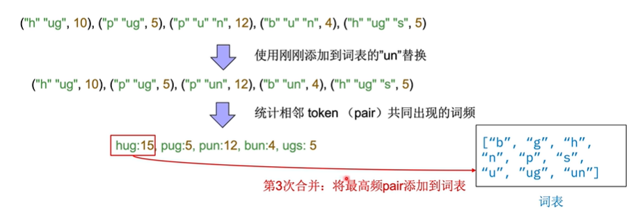
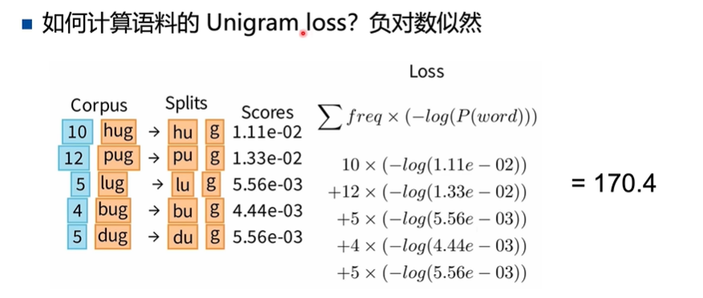

## Tokenizer
### 一. Transformer的输入
- 输入的是token的id，token的embedding是学习得到的，每个token有一个embedding，维度是d_model 

- **embedding layer是一个vocab_size * d_model大小的矩阵**，d_model是每个embedding的向量维度，

### 二. Tokenizer的作用
- 将文本处理成token的序列，**将文本序列转化为数字序列（token的编号），通过token的编号在embedding layer中查找对应的word embedding**，把所有的embedding组成一个大的矩阵，输入到decoder端(decoder-only模型)

- sub-word based

### 三. Word-based Tokenizers
- 需要添加特殊规则，复杂化

- 会生成一个非常大的embedding layer

### 四. Character-based Tokenizers

- 单个字符的信息量少，模型性能差，token序列长

- 对比
    - 保证单个token信息量足够，并且词表不大

### 五. Subword-based Tokenizers

#### 1. Byte-Pair Encoding(BPE)
- 词频统计与词表合并
- 统计相邻token-pair出现的词频

- BPE的合并次数是超参数，每次合并会增加一个token到词表

#### 2. Byte-level BPE
- 将字节视为基本的token，而不是单个字符

- 具体的，BBPE考虑将一段文本的UTF-8编码(UTF-8保证任何语言都可以通用)中的一个字节(8位)256个不同的编码作为基础词表。

- 相比ASCII只能覆盖英文字符，**UTF-8编码创建的本身就是为了通用的将世界上不同的语言字符尽可能全部用一套编码进行编号**，同时相比UTF-32对于每个字符都采用4位字节（byte）过于冗长。**改进的UTF-8编码是一个变长的编码，有1～4个范围的字节(bytes)长度。对于不同语言中字符采用不同长度的字节编码**，例如英文字符基本都是1个字节（byte），中文汉字通常需要2～3个字节，具体如下图所示：
- 在计算机中，每个字节(Bype) 有8位的2进制编码，在电脑显示时全部用2进制太冗长，因此**每个字节(bytes) 通常使用2个16进制编码(0～F) 进行表示**。例如: 字母 'A'的unicode-8 用十进制表示的值是：65，两位16进制表示就是 : 41，与下图“BBPE在不同词表数量下的对日本、英语的编码结果”过程也是符合。
- BBPE算法在基于字节（Byte）进行合并过程和BPE一致、也是选取出现频数最高的字符对进行合并，合并过程如下图所示： 关注到红色箭头，输入是日文当词表大小是1K时，A8 BC 两个字节并没有合并成一个 Token，在词表大小是2K时，A8BC被BBPE合并成一个Token。同理我们观察到在 1K时，E595 8F 没有被合并，在2K时被合并成 日本 "聞" 。

- 同时关注上图中Byte层，当输入Original是不同语言（日本，英语）时，在字节（byte) 层面有一定几率会出现相同的一段字节(byte)编码，从某总程度上具有一定迁移性。同时也正是由于字节层面比字符粒度更低一层，也会导致在解码的过程中对于某个字节不确定是来自某个Character还是单独的Character中从而导致歧义。这个时候可能需要借助上下文的信息和一些动态规划的算法来进行解码。

在GPT2论文中提到如果使用UTF-8的字符编码（变长1～4位字节编码）作为基础单元去构建词表时，未融合前词表就有超过130000个不同Token。因此Byte-level BPE只用单个UTF-8字符编码中的单个字节，即原始词表只有256个不同的编码作为词表中基础的单元去做BPE的融合过程，经过融合后最终GPT2的词表仅仅只有50000多个Token。

BBPE从性能和原理上和BPE大差不差，最主要区别是BPE基于char粒度去执行合并的过程生成词表，而BBPE是基于4个字节、总共256个不同的字节编码（Byte) 去执行合并过程生成词表。
 

#### 3. WordPiece

- hu-gging pair得分可能更高，因为hu和##gging出现的频率比较低，表明他们没必要单独成为一个token，可以进行合并
- 优先合并词表中不太频繁的pair，token1和token2不太频繁，pair频繁

 

#### 4. Unigram
- 不断缩小词表

- 删掉p%对词表的表达能力影响不大

- **每个词的出现都是独立的**，_是空格
- bigram的联合概率不同，p(t1,t2,t3) = p(t1) * p(t2|t1) * p(t3|t1,t2)

 

#### 5. SentencePiece
- 经常使用BBPE和Unigram

