## 二、Word Embedding（词嵌入）
- ⾃然语⾔是⼀套⽤来表达含义的复杂系统。在这套系统中，`词是表义的基本单元`。顾名思义，`词向量是⽤来表⽰词的向量，也可被认为是词的特征向量或表征`。**把词映射为实数域向量的技术也叫词嵌⼊（word embedding）。** 近年来，词嵌⼊已逐渐成为⾃然语⾔处理的基础知识。
- **词向量**（word embedding）是一个`固定长度的实值向量`
- 词向量是神经语言模型的`副产品`。
- 在NLP(自然语言处理)领域，文本表示是第一步，也是很重要的一步，通俗来说就是`把人类的语言符号转化为机器能够进行计算的数字`，因为普通的文本语言机器是看不懂的，必须通过转化来表征对应文本。早期是基于规则的方法进行转化，而现代的方法是基于统计机器学习的方法。数据决定了机器学习的上限,而算法只是尽可能逼近这个上限，在本文中`数据指的就是文本表示，文本表示分为离散表示和分布式表示`

### 1. 离散表示
- One-hot表示
    - One-hot简称`热向量编码`，也是特征工程中最常用的方法。其步骤如下：
        - `构造文本分词后的字典`，每个分词是一个比特值，比特值为0或者1。
        - `每个分词的文本表示为该分词的比特位为1，其余位为0的矩阵`。
    - 例如：John likes to watch movies. Mary likes too. John also likes to watch football games.
        - 以上两句可以`构造一个词典`，**{"John": 1, "likes": 2, "to": 3, "watch": 4, "movies": 5, "also": 6, "football": 7, "games": 8, "Mary": 9, "too": 10}** 
        - 每个`词典索引对应着比特位(第几位)`。那么利用One-hot表示为：
    **John: [1, 0, 0, 0, 0, 0, 0, 0, 0, 0] likes: [0, 1, 0, 0, 0, 0, 0, 0, 0, 0]** 
    - 缺点
        - 随着`语料库的增加，数据特征的维度会越来越大`，产生一个维度很高，又很稀疏的矩阵。
        - 这种表示方法的`分词顺序和在句子中的顺序是无关`的，`不能保留词与词之间的关系信息`。

- 词袋模型
    - 词袋模型(Bag-of-words model)，像是`句子或是文件这样的文字可以用一个袋子装着这些词的方式表现`，这种表现方式`不考虑文法以及词的顺序`。**文档的向量表示可以直接将各词的词向量表示加和**
    - 例如：John likes to watch movies. Mary likes too. 
    John also likes to watch football games.
        - 以上两句可以`构造一个词典`，**{"John": 1, "likes": 2, "to": 3, "watch": 4, "movies": 5, "also": 6, "football": 7, "games": 8, "Mary": 9, "too": 10}** 
        - 那么第一句的向量表示为：[1,2,1,1,1,0,0,0,1,1]，其中的`2表示likes在该句中出现了2次`，依次类推
    - 缺点
        - 词向量化后，词与词之间是有大小关系的，不一定词出现的越多，权重越大。
        - `词与词之间是没有顺序关系的`。

- TF-IDF
    - TF-IDF（term frequency–inverse document frequency）是一种`用于信息检索与数据挖掘的常用加权技术`。TF意思是词频(Term Frequency)，IDF意思是逆文本频率指数(Inverse Document Frequency)。
    - `字词的重要性随着它在文件中出现的次数成正比增加，但同时会随着它在语料库中出现的频率成反比下降`。一个词语在一篇文章中出现次数越多, 同时在所有文档中出现次数越少, 越能够代表该文章。
    - 缺点：还是没有把词与词之间的关系顺序表达出来。
    - 分母之所以加1，是为了避免分母为0。那么，\( TF-IDF = TF \times IDF \)，从这个公式可以看出，当 \( w \) 在文档中出现的次数增大时，而 TF-IDF 的值是减小的，所以也就体现了以上所说的了。

\[
TF_w = \frac{\text{在某一类中词条} w \text{出现的次数}}{\text{该类中所有的词条总数}}
\]

\[
IDF = \log \left( \frac{\text{语料库的文档总数}}{\text{包含词条} w \text{的文档总数} + 1} \right)
\]

- n-gram模型
    - n-gram模型`为了保持词的顺序，做了一个滑窗的操作`，这里的`n表示的就是滑窗的大小，例如2-gram模型`，也就是把2个词当做一组来处理，然后向后移动一个词的长度，再次组成另一组词，把这些生成一个字典，按照`词袋模型的方式进行编码`得到结果。该模型考虑了词的顺序。
    - 先前的例子构造词典：{"John likes”: 1, "likes to”: 2, "to watch”: 3, "watch movies”: 4, "Mary likes”: 5, "likes too”: 6, "John also”: 7, "also likes”: 8, “watch football”: 9, "football games": 10}
    - 第一句的向量表示为：[1, 1, 1, 1, 1, 1, 0, 0, 0, 0]，其中`第一个1表示John likes在该句中出现了1次`，依次类推。
    - 缺点：随着`n的大小增加，词表会成指数型膨胀`，会越来越大。

- 存在的问题
    - `无法衡量词向量之间的关系`。
    - 词表的`维度随着语料库的增长而膨胀`。
    - n-gram词序列随语料库增长呈指数型膨胀，更加快。
    - 离散数据来表示文本会带来`数据稀疏问题，导致丢失了信息`，与我们生活中理解的信息是不一样的。

### 2. 分布式表示
- `用一个词附近的其它词来表示该词，这是现代统计自然语言处理中最有创见的想法之一`。当初科学家发明这种方法是基于人的语言表达，认为一个词是由这个词的周边词汇一起来构成精确的语义信息。就好比，物以类聚人以群分，如果你想了解一个人，可以通过他周围的人进行了解，因为周围人都有一些共同点才能聚集起来。
- 共现矩阵
    - 共现矩阵顾名思义就是共同出现的意思，词文档的共现矩阵主要用于发现主题(topic)，用于主题模型，如LSA。
    - 局域窗中的word-word共现矩阵可以`挖掘语法和语义信息`，例如：
        - I like deep learning. I like NLP. I enjoy flying
        - 有以上三句话，设置滑窗为2，可以得到一个词典：{"I like","like deep","deep learning","like NLP","I enjoy","enjoy flying","I like"}。
        - 我们可以得到一个共现矩阵(对称矩阵)：`中间的每个格子表示的是行和列组成的词组在词典中共同出现的次数`，也就体现了共现的特性。
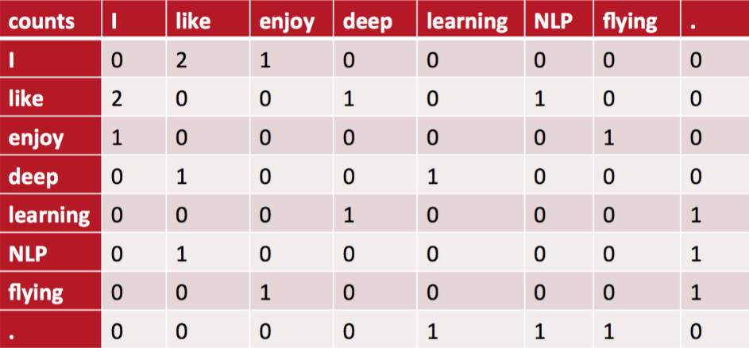
    - 缺点
        - 向量维数随着词典大小线性增长。
        - 存储整个词典的空间消耗非常大。
        - 一些模型如文本分类模型会面临稀疏性问题。
        - 模型会欠稳定，每新增一份语料进来，稳定性就会变化。

### 3. 神经网络表示
#### 3.1 NNLM
- NNLM (Neural Network Language model)，神经网络语言模型是03年提出来的，`通过训练得到中间产物--词向量矩阵`，这就是我们要得到的文本表示向量矩阵。
- NNLM说的是定义一个前向窗口大小，把这个窗口中最后一个词当做y，把之前的词当做输入x，通俗来说就是`预测这个窗口中最后一个词出现概率的模型`。
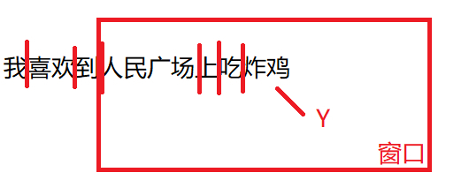

#### 3.2 Word2Vec
- Word2Vec 本质上也是一个`神经语言模型`，但是它的目标并不是语言模型本身，而是词向量；因此，其所作的一系列优化，都是`为了更快更好的得到词向量`
- Word2Vec 提供了两套模型：CBOW（Continues Bag of Words）和 Skip-Gram(SG)
    - CBOW 在已知 context(w) 的情况下，预测 w，`用上下文来预测中间词`
    - SG 在已知 w 的情况下预测 context(w)，`用中间词来预测上下文`
- 从`训练集的构建方式`可以更好地理解和区别 CBOW 和 SG 模型
  - 每个`训练样本为一个二元组` \((x, y)\)，其中 \(x\) 为特征，\(y\) 为标签
  - 假设`上下文窗口的大小` \(context\_window = 5\)，即

  \[
  \{w_{t-2}, w_{t-1}, w_t, w_{t+1}, w_{t+2}\}
  \]

  - 或者说 \(skip\_window = 2\)，有 \(context\_window = skip\_window \times 2 + 1\)

  - CBOW 的训练样本为：

  \[
  (\{w_{t-2}, w_{t-1}, w_{t+1}, w_{t+2}\}, w_t)
  \]

  - SG 的训练样本为：

  \[
  (w_t, w_i), \quad i \in \{t-2, t-1, t+1, t+2\}
  \]

  - 一般来说， \(skip\_window \leq 10\)

- 除了两套模型，Word2Vec 还提供了`两套优化方案，分别基于 Hierarchical Softmax（层次SoftMax）和 Negative Sampling（负采样）`

## 三、seq2seq
### 1. 什么是seq2seq
- 在⾃然语⾔处理的很多应⽤中，`输⼊和输出都可以是不定⻓序列`。以机器翻译为例，输⼊可以是⼀段不定⻓的英语⽂本序列，输出可以是⼀段不定⻓的法语⽂本序列，例如：
    - 英语输⼊：“They”、“are”、“watching”、“.”
    - 法语输出：“Ils”、“regardent”、“.”

- `当输⼊和输出都是不定⻓序列时，我们可以使⽤编码器—解码器（encoder-decoder）或者seq2seq模型。序列到序列模型，简称seq2seq模型`。这两个模型本质上都⽤到了`两个循环神经⽹络，分别叫做编码器和解码器`。`编码器⽤来分析输⼊序列，解码器⽤来⽣成输出序列`。两个循环神经网络是`共同训练`的。

- 下图描述了使⽤编码器—解码器将上述英语句⼦翻译成法语句⼦的⼀种⽅法。在训练数据集中，我们可以在每个句⼦后附上`特殊符号“<eos>”（end of sequence）以表⽰序列的终⽌`。编码器每个时间步的输⼊依次为英语句⼦中的单词、标点和特殊符号“<eos>”。下图中使⽤了`编码器在最终时间步的隐藏状态作为输⼊句⼦的表征或编码信息`。`解码器在各个时间步中使⽤输⼊句⼦的编码信息和上个时间步的输出以及隐藏状态作为输⼊`。我们希望解码器在各个时间步能正确依次输出翻译后的法语单词、标点和特殊符号“<eos>”。需要注意的是，`解码器在最初时间步的输⼊⽤到了⼀个表⽰序列开始的特殊符号“<bos>”（beginning of sequence）`。
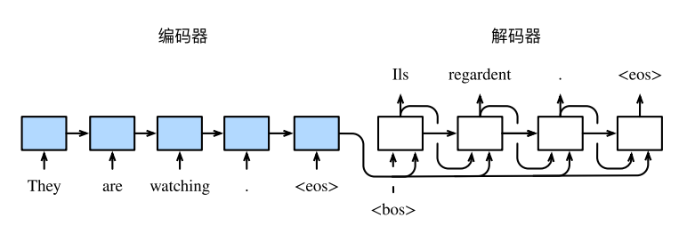

### 2. 编码器
- 编码器的作用是`把一个不定长的输入序列变换成一个定长的背景变量c`，并在该背景变量中`编码输入序列信息`。常用的编码器是`循环神经网络`。

- 让我们考虑批量大小为1的时序数据样本。假设输入序列是`x1,...,xT`，例如`xi`是输入句子中的第`i`个词。**在时间步`t`，循环神经网络将输入`xt`的特征向量`xt`和上个时间步的隐藏状态 `h_t-1` 变换为当前时间步的隐藏状态`ht`。** 我们可以用函数`f`表达`循环神经网络隐藏层的变换`：

\[ h_t = f(x_t, h_{t-1}) \]

接下来，编码器通过自定义函数`q`将`各个时间步的隐藏状态变换为背景变量`：

\[ c = q(h_1, ..., h_T) \]

例如，当选择 `q(h_1, ..., h_T) = h_T` 时，`背景变量是输入序列最终时间步的隐藏状态``hT`。

- 以上描述的编码器是一个`单向的循环神经网络`，`每个时间步的隐藏状态只取决于该时间步及之前的输入子序列`。我们也可以使用`双向循环神经网络构造编码器`。在这种情况下，`编码器每个时间步的隐藏状态同时取决于该时间步之前和之后的子序列`（包括当前时间步的输入），并`编码了整个序列的信息`。

### 3. 解码器
- 刚刚已经介绍，`编码器输出的背景变量` `c` `编码了整个输入序列` `x1,..., xT` 的信息。给定训练样本中的输出序列 `y1, y2,..., yT'`，对每个时间步 \( t' \)（符号与输入序列或编码器的时间步 `t` 有区别），解码器输出 \( y_{t'} \) 的条件概率将基于之前的输出序列 \( y_1, \ldots, y_{t'-1} \) 和背景变量 `c`，即：

\[ P(y_{t'} \mid y_1, \ldots, y_{t'-1}, c) \]

- 为此，我们可以使用`另一个循环神经网络作为解码器`。在输出序列的时间步 \( t' \)，解码器将上一时间步的输出 \( y_{t'-1} \) 以及背景变量 `c` 作为输入，并将它们与上一时间步的隐藏状态 \( s_{t'-1} \) 变换为当前时间步的隐藏状态 \( s_{t'} \)。因此，我们可以用函数 `g` 表达解码器隐藏层的变换：

\[ s_{t'} = g(y_{t'-1}, c, s_{t'-1}) \]

- 有了解码器的隐藏状态后，我们可以使用自定义的输出层和softmax运算来计算 \( P(y_{t'} \mid y_1, \ldots, y_{t'-1}, c) \)，例如，基于当前时间步的解码器隐藏状态 \( s_{t'} \)、上一时间步的输出 \( y_{t'-1} \) 以及背景变量 `c` 来计算当前时间步输出 \( y_{t'} \) 的概率分布。

### 4. 训练模型
- 根据最大似然估计，我们可以最大化输出序列基于输入序列的条件概率：

\[ \begin{array}{l}
P(y_1,\ldots,y_{t'-1}|x_1,\ldots,x_T)=\prod_{t'=1}^{T'} P(y_{t'}|y_1,\ldots,y_{t'-1},x_1,\ldots,x_T) \\
=\prod_{t'=1}^{T'} P(y_{t'}|y_1,\ldots,y_{t'-1},c)
\end{array} \]

- 并得到该输出序列的损失：

\[ -\log P(y_1,\ldots, y_{t'-1}|x_1,\ldots, x_T) = -\sum_{t'=1}^{T'} \log P(y_{t'}|y_1,\ldots, y_{t'-1}, c) \]

- 在模型训练中，所有输出序列损失的均值通常作为需要最小化的损失函数。在上图所描述的模型预测中，我们需要将解码器在上一个时间步的输出作为当前时间步的输入。与此不同，`在训练中我们也可以将标签序列（训练集的真实输出序列）在上一个时间步的标签作为解码器在当前时间步的输入`。这叫做强制教学（teacher forcing）。

### 5. seq2seq模型预测

### 6. Bleu得分

## 四、Attention机制
### 1. 什么是Attention机制
- 在“编码器-解码器(seq2seq)”一节里，`解码器在各个时间步依赖相同的背景变量来获取输入序列信息`。当编码器为`循环神经网络`时，`背景变量来自它最终时间步的隐藏状态`。

- 现在，让我们再次思考那一节提到的翻译例子：输入为英语序列 "They" "are" "watching" "."，输出为法语序列 "Ils" "regardent" "."。不难想到，`解码器在生成输出序列中的每一个词时可能只需利用输入序列某一部分的信息`。例如，在输出序列的时间步1，解码器可以主要依赖 "They" "are" 的信息来生成 "Ils"，在时间步2则主要使用来自 "watching" 的编码信息生成 "regardent"，最后在时间步3则直接映射句号 "."。这看上去就像是`在解码器的每一时间步对输入序列中不同时间步的表征或编码信息分配不同的注意力一样`。这也是`注意力机制的由来`。

- 仍然以循环神经网络为例，`注意力机制通过对编码器所有时间步的隐藏状态做加权平均来得到背景变量`。`解码器在每一时间步调整这些权重，即注意力权重`，从而能够在`不同时间步分别重点关注输入序列中的不同部分`并编码进相应时间步的背景变量。

- 在注意力机制中，`解码器的每一时间步将使用可变的背景变量`。记 \( c_{t'} \) 是解码器在时间步 \( t' \) 的背景变量，那么解码器在该时间步的隐藏状态可以改写为：

\[ s_{t'} = g(y_{t'-1}, c_{t'}, s_{t'-1}) \]

- 这里的关键是如何`计算背景变量` \( c_{t'} \) 和如何利用它来`更新隐藏状态` \( s_{t'} \)。下面将分别描述这两个关键点。

### 2. 编解码器中的Attention
#### 2.1 计算背景向量
- 下图描绘了注意⼒机制如何为`解码器在时间步 2 计算背景变量`。
    - 函数 a 根据`解码器在时间步 1 的隐藏状态和编码器在各个时间步的隐藏状态计算softmax运算的输⼊`。
    - softmax运算输出`概率分布`并对`编码器各个时间步的隐藏状态做加权平均`，从而得到背景变量。
    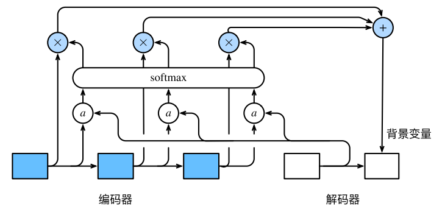
    - 令编码器在时间步t的隐藏状态为 ht，且总时间步数为 T。那么解码器在时间步 t′ 的背景变量为所有编码器隐藏状态的加权平均：
    \[ c_{t'} = \sum_{t=1}^{T} \alpha_{t't} h_t \]

- 矢量化计算背景变量
    - 我们还可以对注意力机制采用`更高效`的矢量化计算。我们先定义，在上述例子中，`查询项为解码器的隐藏状态，键项和值项均为编码器的隐藏状态`。

    - 广义上，`注意力机制的输入包括查询项以及一一对应的键项和值项，其中值项是需要加权平均的一组项。`在加权平均中，`值项的权重来自查询项以及与该值项对应的键项的计算。`

    - 让我们考虑一个常见的简单情形，即编码器和解码器的隐藏单元个数均为 \( h \)，且函数 \( a(s,h) = s^Th \)。假设我们希望根据解码器单个隐藏状态 \( s_{t'-1} \) 和编码器所有隐藏状态 \( h_t, t = 1,...,T \) 来计算背景向量 \( c_{t'} \)。我们可以将查询项矩阵 \( Q \) 设为 \( s_{t'-1}^T \)，并令键项矩阵 \( K \) 和值项矩阵 \( V \) 相同，且第 \( t \) 行均为 \( h_t^T \)。此时，我们只需要通过矢量化计算：

    \[ \text{softmax}(QK^T)V \]

    - 即可算出转置后的背景向量 \( c_{t'}^T \)。当查询项矩阵 \( Q \) 的行数为 \( n \) 时，上式将得到 \( n \) 行的输出矩阵。输出矩阵与查询项矩阵在相同行上一一对应。

#### 2.2 更新隐藏状态
- 现在我们描述第二个关键点，即更新隐藏状态。以门控循环单元（GRU）为例，在解码器中我们可以对门控循环单元的设计稍作修改，从而变换上一时间步 \( t'-1 \) 的输出 \( y_{t'-1} \)、隐藏状态 \( s_{t'-1} \) 和当前时间步 \( t' \) 的含注意力机制的背景变量 \( c_{t'} \)。解码器在时间步 \( t' \) 的隐藏状态为：

\[ s_{t'} = z_{t'} \odot s_{t'-1} + (1 - z_{t'}) \odot \tilde{s}_{t'} \]

其中的重置门、更新门和候选隐藏状态分别为：

\[ \begin{align*}
r_{t'} &= \sigma(W_{yr}y_{t'-1} + W_{sr}s_{t'-1} + W_{cr}c_{t'} + b_{r}) \\
z_{t'} &= \sigma(W_{yz}y_{t'-1} + W_{sz}s_{t'-1} + W_{cz}c_{t'} + b_{z}) \\
\tilde{s}_{t'} &= \tanh(W_{ys}y_{t'-1} + W_{ss}(s_{t'-1} \odot r_{t'-1}) + W_{cs}c_{t'} + b_{s})
\end{align*} \]

其中含下标的 \( W \) 和 \( b \) 分别为门控循环单元的权重参数和偏差参数。

### 3. Attention的本质
#### 3.1 机器翻译说明Attention
- 本节先以机器翻译作为例子讲解最常见的Soft Attention模型的基本原理，之后抛离Encoder-Decoder框架抽象出了注意力机制的本质思想。

- 如果拿机器翻译来解释这个Encoder-Decoder框架更好理解，比如输入的是英文句子：Tom chase Jerry，Encoder-Decoder框架逐步生成中文单词：“汤姆”，“追逐”，“杰瑞”。

- 在翻译“杰瑞”这个中文单词的时候，`模型里面的每个英文单词对于翻译目标单词“杰瑞”贡献是相同的，很明显这里不太合理`，显然“Jerry”对于翻译成“杰瑞”更重要，但是模型是无法体现这一点的，这就是为何说它没有引入注意力的原因。

- 没有引入注意力的模型在输入句子比较短的时候问题不大，但是`如果输入句子比较长，此时所有语义完全通过一个中间语义向量来表示，单词自身的信息已经消失，可想而知会丢失很多细节信息` ，这也是**为何要引入注意力模型的重要原因**。

- 上面的例子中，如果引入Attention模型的话，应该在翻译“杰瑞”的时候，`体现出英文单词对于翻译当前中文单词不同的影响程度`，比如给出类似下面一个概率分布值：

（Tom,0.3）(Chase,0.2) (Jerry,0.5)

**每个英文单词的概率代表了翻译当前单词“杰瑞”时，注意力分配模型分配给不同英文单词的注意力大小。**这对于正确翻译目标语单词肯定是有帮助的，因为引入了新的信息。

- 同理，目标句子中的每个单词都应该学会其对应的源语句子中单词的注意力分配概率信息。`这意味着在生成每个单词yi的时候，原先都是相同的中间语义表示C会被替换成根据当前生成单词而不断变化的Ci`。理解Attention模型的关键就是这里，`即由固定的中间语义表示C换成了根据当前输出单词来调整成加入注意力模型的变化的Ci`。增加了注意力模型的Encoder-Decoder框架理解起来如下图所示。
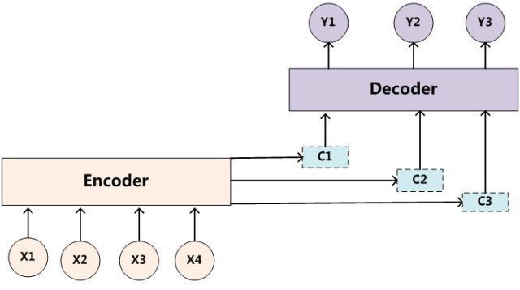

- **每个 \( C_i \) 可能对应着不同的源语句子单词的注意力分配概率分布**。例如，对于上述的英汉翻译来说，其对应的信息可能如下：

\[ C(\text{"汤姆"}) = g(0.6 \cdot f_2(\text{"tom"}), 0.2 \cdot f_2(\text{"chase"}), 0.2 \cdot f_2(\text{"jerry"})) \]

\[ C(\text{"追逐"}) = g(0.2 \cdot f_2(\text{"tom"}), 0.7 \cdot f_2(\text{"chase"}), 0.1 \cdot f_2(\text{"jerry"})) \]

\[ C(\text{"杰瑞"}) = g(0.3 \cdot f_2(\text{"tom"}), 0.2 \cdot f_2(\text{"chase"}), 0.5 \cdot f_2(\text{"jerry"})) \]

- 其中，\( f_2 \) 函数代表Encoder对输入英文单词的某种变换函数。例如，**如果Encoder使用的是RNN模型，这个 \( f_2 \) 函数的结果往往是某个时刻输入 \( x_i \) 后隐层节点的状态值；** \( g \) 代表Encoder根据单词的中间表示合成整个句子中间语义表示的变换函数。一般的做法中，**\( g \) 函数就是对构成元素加权求和**，即下列公式：

\[ C_i = \sum_{j=1}^{L_x} a_{ij} h_j \]

- **其中，\( L_x \) 代表输入句子Source的长度，\( a_{ij} \) 代表在Target输出第 \( i \) 个单词时Source输入句子中第 \( j \) 个单词的注意力分配系数，而 \( h_j \) 则是Source输入句子中第 \( j \) 个单词的语义编码。** 假设下标 \( i \) 就是上面例子所说的“汤姆”，那么 \( L_x \) 就是3，\( h_1 = f("Tom") \), \( h_2 = f("Chase") \), \( h_3 = f("Jerry") \) 分别是输入句子每个单词的语义编码，对应的注意力模型权值则分别是0.6, 0.2, 0.2，所以 \( g \) 函数本质上就是个加权求和函数。

#### 3.2 注意力分配概率计算
- 这里还有一个问题：生成目标句子某个单词，比如“汤姆”的时候，如何知道Attention模型所需要的输入句子单词注意力分配概率分布值呢？换句话说，“汤姆”对应的输入句子Source中各个单词的概率分布：(Tom, 0.6)(Chase, 0.2)(Jerry, 0.2)是如何得到的呢？

- 对于采用RNN的Decoder来说，在时刻 \( i \)，如果要生成 \( y_i \) 单词，我们是可以知道Target在生成 \( y_i \) 之前的时刻 \( i-1 \) 时，隐层节点 \( h_{i-1} \) 的输出值的。**而我们的目的是要计算生成 \( y_i \) 时输入句子中的单词“Tom”、“Chase”、“Jerry”对 \( y_i \) 来说的注意力分配概率分布** ，那么可以**用Target输出句子 \( i-1 \) 时刻的隐层节点状态 \( h_{i-1} \) 去一一和输入句子Source中每个单词对应的RNN隐层节点状态 \( h_j \) 进行对比**，即通过函数 \( F(h_j, h_{i-1}) \) 来获得**目标单词 \( y_i \) 和每个输入单词对应的对齐可能性**。这个 \( F \) 函数在不同论文里可能会采取不同的方法，然后函数 \( F \) 的**输出经过Softmax进行归一化**就得到了符合概率分布取值区间的注意力分配概率分布数值。
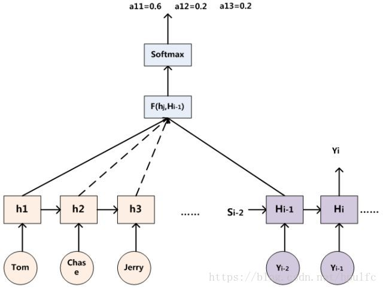

#### 3.3 Attention的物理含义
- 一般在自然语言处理应用里会把**Attention模型看作是输出Target句子中某个单词和输入Source句子每个单词的对齐模型**，这是非常有道理的。

- **目标句子生成的每个单词对应输入句子单词的概率分布可以理解为输入句子单词和这个目标生成单词的对齐概率，** 这在机器翻译语境下是非常直观的：传统的统计机器翻译一般在做的过程中会专门有一个短语对齐的步骤，而注意力模型其实起的是相同的作用。

- 如果把Attention机制从上文讲述例子中的Encoder-Decoder框架中剥离，并进一步做抽象，可以更容易看懂Attention机制的本质思想。
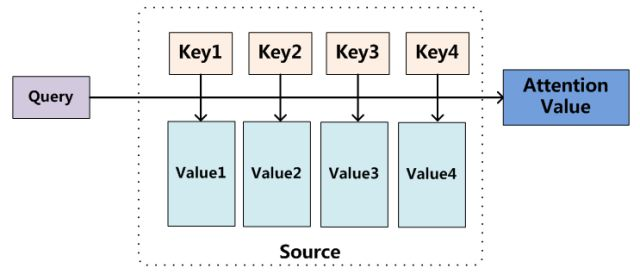

- 我们可以这样来看待Attention机制（参考上图）：**将Source中的构成元素想象成是由一系列的 `<Key, Value>` 数据对构成。此时给定Target中的某个元素 `Query`，通过计算 `Query` 和各个 `Key` 的相似性或者相关性，得到每个 `Key` 对应 `Value` 的权重系数，然后对 `Value` 进行加权求和，即得到了最终的Attention数值。** 所以本质上Attention机制是对Source中元素的 `Value` 值进行加权求和，而 `Query` 和 `Key` 用来计算对应 `Value` 的权重系数。即可以将其本质思想改写为如下公式：

\[ Attention(Query, Source) = \sum_{i=1}^{L_x} Similarity(Query, key_i) \times Value_i \]

- 其中，\( L_x = ||Source|| \) 代表Source的长度，公式含义即如上所述。上文所举的机器翻译的例子里，因为在计算Attention的过程中，Source中的 `Key` 和 `Value` 合二为一，指向的是同一个东西，也即输入句子中每个单词对应的语义编码，所以可能不容易看出这种能够体现本质思想的结构。

- 至于Attention机制的具体计算过程，如果对目前大多数方法进行抽象的话，可以将其**归纳为两个过程：第一个过程是根据 `Query` 和 `Key` 计算权重系数，第二个过程根据权重系数对 `Value` 进行加权求和**。而`第一个过程又可以细分为两个阶段：第一个阶段根据 Query 和 Key 计算两者的相似性或者相关性；第二个阶段对第一阶段的原始分值进行归一化处理(softmax)转换成概率分布。`

### 4. Self-Attention模型
- Self Attention也经常被称为intra Attention（内部Attention），最近一年也获得了比较广泛的使用，比如Google最新的机器翻译模型内部大量采用了Self Attention模型。

- 在一般任务的Encoder-Decoder框架中，输入Source和输出Target内容是不一样的，比如对于英-中机器翻译来说，Source是英文句子，Target是对应的翻译出的中文句子，`Attention机制发生在Target的元素Query和Source中的所有元素之间`。**而Self Attention顾名思义，指的不是Target和Source之间的Attention机制，而是Source内部元素之间或者Target内部元素之间发生的Attention机制，也可以理解为Target=Source这种特殊情况下的注意力计算机制。** 其具体计算过程是一样的，只是计算对象发生了变化而已，所以此处不再赘述其计算过程细节。

- 很明显，`引入Self Attention后会更容易捕获句子中长距离的相互依赖的特征`，因为如果是`RNN或者LSTM，需要依次序序列计算`，对于远距离的相互依赖的特征，要经过若干时间步步骤的信息累积才能将两者联系起来，而`距离越远，有效捕获的可能性越小`。

- 但是Self Attention在计算过程中会直接`将句子中任意两个单词的联系通过一个计算步骤直接联系起来`，所以`远距离依赖特征之间的距离被极大缩短，有利于有效地利用这些特征`。除此外，Self Attention对于`增加计算的并行性`也有直接帮助作用。这是为何Self Attention逐渐被广泛使用的主要原因。

## 五、Transformer
### 1. 什么是Transformer
- 《Attention Is All You Need》是一篇Google提出的将`Attention思想`发挥到极致的论文。这篇论文中提出一个全新的模型，叫 Transformer，抛弃了以往深度学习任务里面使用到的 CNN 和 RNN。目前大热的`Bert就是基于Transformer构建的`，这个模型广泛应用于NLP领域，例如机器翻译，问答系统，文本摘要和语音识别等等方向。
- **Transformer 用于学习句子中的长距离依赖关系，同时执行序列到序列的建模。**
- **如何理解编码器和解码器**
    - Transformer使用了"Encoder-Decoder" 编码器-解码器的结构，这种结构被广泛应用于**处理序列到序列**（seq2seq）的学习任务中。这种结构由编码器和解码器两大部分组成，编码（encoding）是一个模式提取的过程，**将输入句子的特征提取出来，存储在一个中间隐状态空间（hidden state）；而解码（decoding）则是将encoder提取出来的特征进行重建，解码成为我们期望的输出。** 如翻译任务：将输入的英语经过编码器编码成中间表示，再使用解码器将这个中间表示解码成中文。

- 它通过**解决可变长度输入、并行化、梯度消失或爆炸、数据规模巨大等问题**，比其他模型表现更好。使用的注意力机制是神经架构的一部分，使其能够动态突出显示输入数据的相关特征，仅关注必要的特征/单词。
- 让我们看一个例子：

    “I poured water from the bottle into the cup until it was full.”

    这里的“it”指的是杯子

    “I poured water from the bottle into the cup until it was empty.”

    这里的“it”指的是瓶子

- 句子中的单一替换改变了对象“it”的引用。对于我或你来说，识别“it”所指的主体/对象是很容易的，但最终的任务是让机器学会这一点。

- 因此，如果我们翻译这样一个句子或尝试生成文本，**机器必须知道单词“it”的指代对象。这可以通过深度学习机制“注意力”来实现。注意力机制的使用赋予了 Transformer 很高的潜力。**

### 2. Transformer的结构
#### 2.1 总体结构
- Transformer的结构和Attention模型一样，Transformer模型中也采用了 `encoer-decoder 架构`。但其结构相比于Attention更加复杂，论文中`encoder层由6个encoder堆叠在一起`，decoder层也一样。
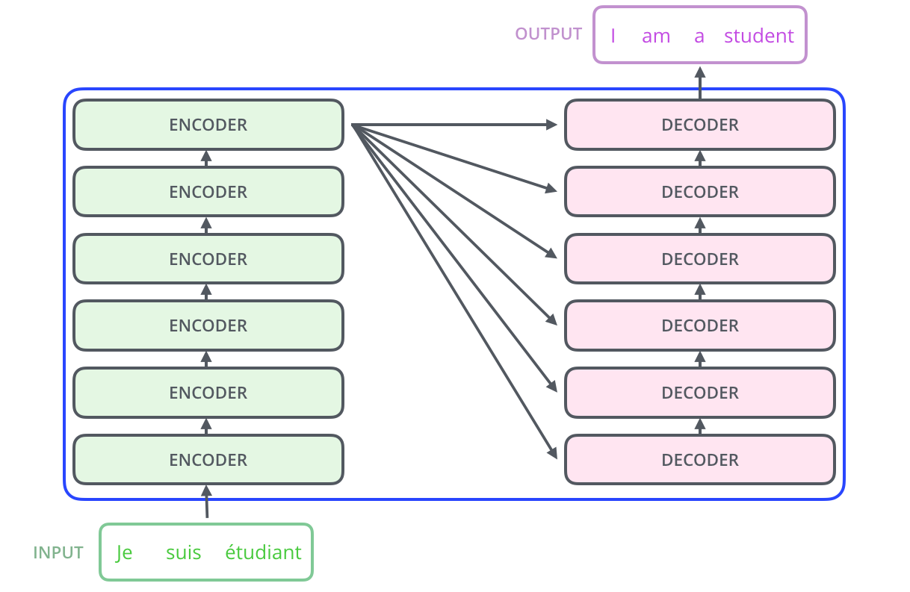

- 每一个encoder和decoder的内部结构如下图：
    - encoder，包含两层，`一个self-attention层和一个前馈神经网络`，self-attention能帮助`当前节点不仅仅只关注当前的词，从而能获取到上下文的语义`。
    - decoder也包含encoder提到的两层网络，但是在这两层中间还有一层attention层，`帮助当前节点获取到当前需要关注的重点内容`。
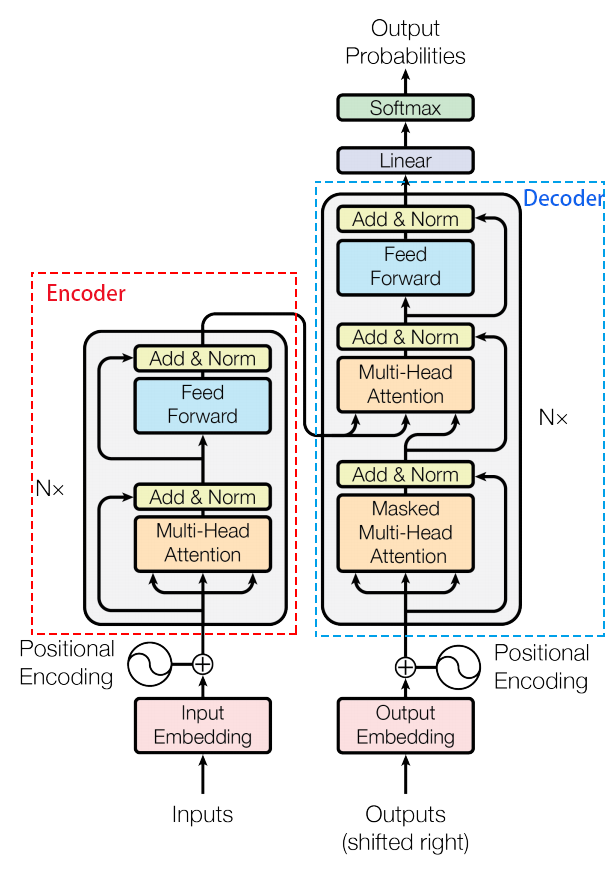

#### 2.2 Encoder层结构
- 首先，模型需要对输入的数据进行一个`embedding操作（把词映射为实数域向量）`，也可以理解为类似w2c的操作，embedding结束之后，输入到encoder层，self-attention处理完数据后把数据送给前馈神经网络，`前馈神经网络的计算可以并行`，得到的输出会`输入到下一个encoder`。
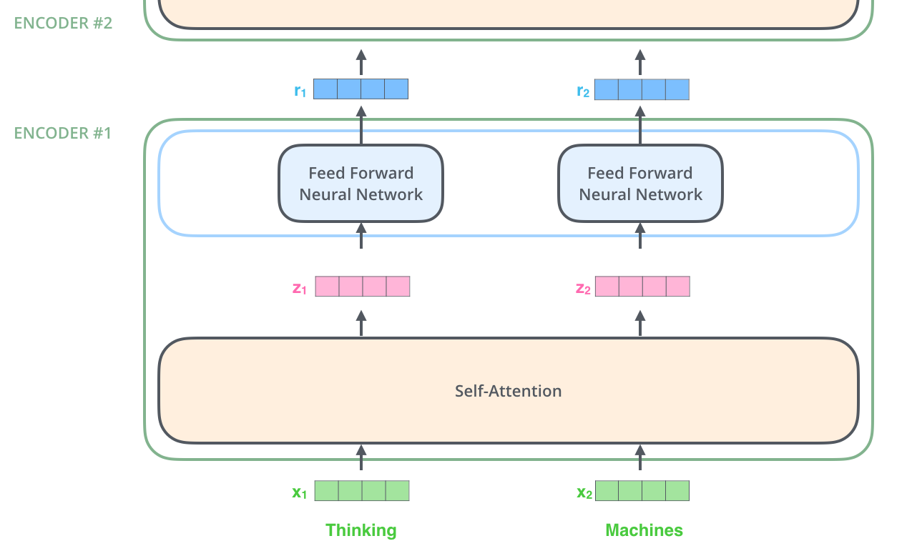

##### 2.2.1 Positional Encoding
- Transformer模型`缺少一种解释输入序列中单词顺序的方法`，这与序列模型不同。为了解决这个问题，Transformer在`编码器层和解码器层的输入`中添加了一个额外的向量**位置编码（Positional Encoding）**，`其维度与词嵌入（embedding）向量的维度相同`。这个向量采用了一种独特的方法，使模型能够学习到这个值，`这个值可以决定当前词的位置，或者说在一个句子中不同词之间的距离`。位置编码的具体计算方法有多种，论文中使用的计算方法如下：

\[ PE(pos, 2i) = sin\left(\frac{pos}{10000^{(\frac{2i}{d_{model}})}}\right) \]

\[ PE(pos, 2i+1) = cos\left(\frac{pos}{10000^{(\frac{2i}{d_{model}})}}\right) \]

- 其中，\( pos \) 指当前词在句子中的位置，\( i \) 是向量中每个值的索引。可以看出，**在偶数位置使用正弦编码，在奇数位置使用余弦编码。**

- 最后，`将这个位置编码与词嵌入的值相加`，作为输入送到下一层。
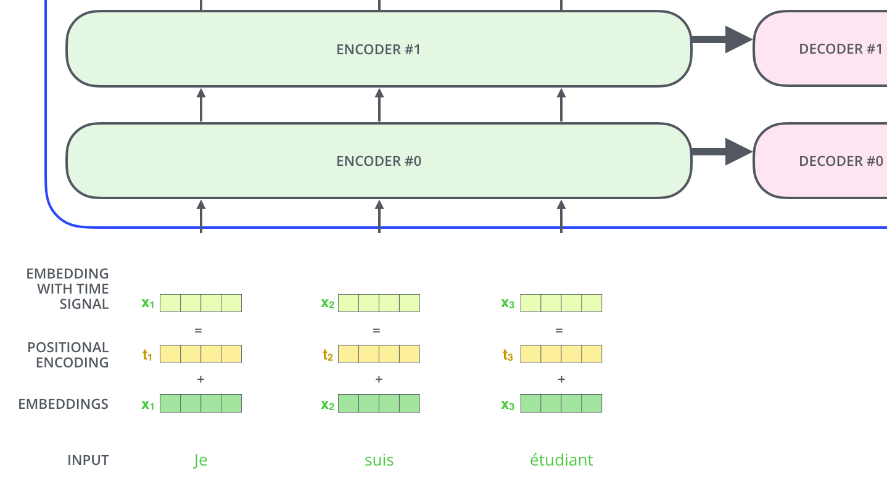

##### 2.2.2 Self-Attention
- 接下来我们详细看一下self-attention，其思想和attention类似，但是self-attention是Transformer用来`将其他相关单词的“理解”转换成我们正在处理的单词的一种思路`，我们看个例子：
The animal didn't cross the street because it was too tired

- 这里的 it 到底代表的是 animal 还是 street 呢，对于我们来说能很简单的判断出来，但是对于机器来说，是很难判断的，self-attention就能够让机器把 it 和 animal 联系起来，接下来我们看下详细的处理过程。

    - 首先，self-attention会计算出`三个新的向量`，在论文中，`向量的维度是512维`，我们把这三个向量分别称为**Query、Key、Value**，这三个向量是`用embedding向量与一个矩阵(WQ, WK, WV)相乘得到的结果`，这个`矩阵是随机初始化的，维度为（64，512）`注意第二个维度需要和embedding的维度一样，其值在`BP的过程中会一直进行更新`，得到的这`三个向量的维度是64`。
    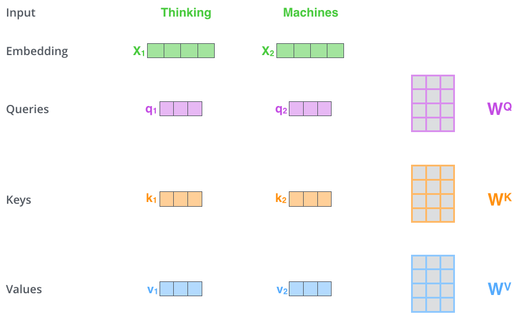

    - 计算`self-attention的分数值`，该分数值决定了**当我们在某个位置encode一个词时，对输入句子的其他部分的关注程度**。这个分数值的计算方法是Query与Key做点乘，以下图为例，首先我们需要针对Thinking这个词，计算出其他词对于该词的一个分数值，首先是针对于自己本身即q1·k1，然后是针对于第二个词即q1·k2。
    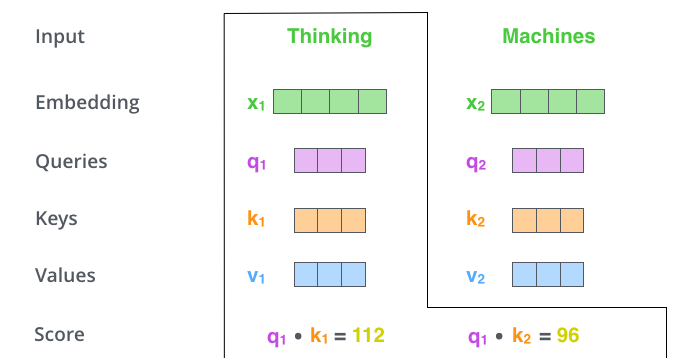

    - 接下来，`把点乘的结果除以一个常数`，这里我们**除以8**，这个值一般是采用上文提到的`矩阵的第一个维度的开方即64的开方8`，当然也可以选择其他的值，然后把得到的结果做一个`softmax的计算`。得到的结果即是`每个词对于当前位置的词的相关性大小`，当然，当前位置的词相关性肯定会会很大。
    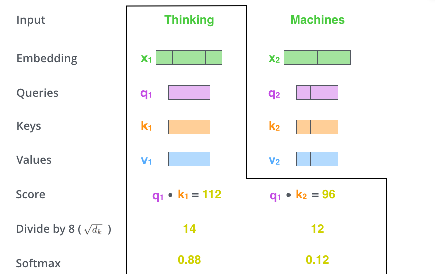

    - 下一步就是`把Value和softmax得到的值进行相乘，并相加`，得到的结果即是self-attetion在当前节点的值。
    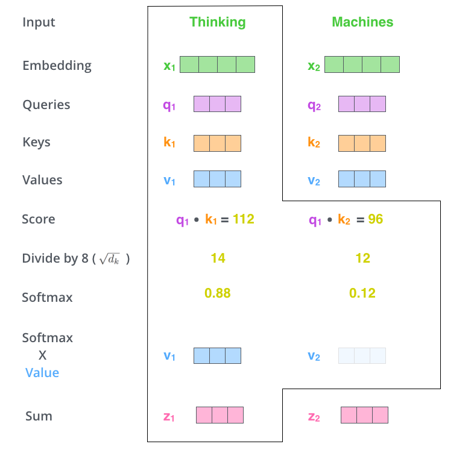

- 在实际的应用场景，`为了提高计算速度，我们采用的是矩阵的方式`，直接计算出Query, Key, Value的矩阵，然后把embedding的值与三个矩阵直接相乘，把得到的新矩阵 Q 与 K 相乘，乘以一个常数，做softmax操作，最后乘上 V 矩阵。

- **这种通过 query 和 key 的相似性程度来确定 value 的权重分布的方法被称为scaled dot-product attention。**
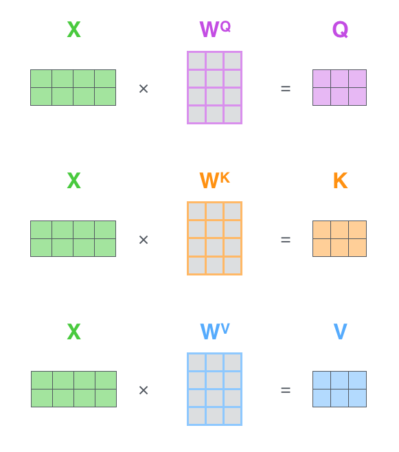

##### 2.2.3 Multi-Headed Attention
- 这篇论文更牛逼的地方是给self-attention加入了另外一个机制，被称为“multi-headed” attention，该机制理解起来很简单，就是说`不仅仅只初始化一组Q、K、V的矩阵，而是初始化多组，tranformer是使用了8组，所以最后得到的结果是8个矩阵(z)。`

##### 2.2.4 Layer normalization
- 在transformer中，每一个子层（self-attetion，Feed Forward Neural Network）之后都会接一个`残缺模块`(Add，类似resnet)，并且有一个Layer normalization。

- Normalization有很多种，但是它们都有一个共同的目的，那就是`把输入转化成均值为0方差为1的数据`。我们在把数据`送入激活函数之前进行normalization`（归一化），因为我们`不希望输入数据落在激活函数的饱和区`。
    - Batch Normalization
        - BN的主要思想就是：在每一层的每一批数据上进行归一化。我们可能会对输入数据进行归一化，但是经过该网络层的作用后，我们的数据已经不再是归一化的了。随着这种情况的发展，`数据的偏差越来越大`，我的反向传播需要考虑到这些大的偏差，这就迫使我们只能使用`较小的学习率来防止梯度消失或者梯度爆炸`。**BN的具体做法就是对每一小批数据，在批这个方向上做归一化**。
    - Layer normalization
        - 它也是归一化数据的一种方式，**不过LN 是在每一个样本上计算均值和方差，而不是BN那种在批方向计算均值和方差！**
    
    

##### 2.2.5 Feed Forward Neural Network
- 这给我们留下了一个小的挑战，`前馈神经网络没法输入 8 个矩阵`呀，这该怎么办呢？所以我们需要一种方式，把 8 个矩阵降为 1 个，首先，我们`把 8 个矩阵连在一起，这样会得到一个大的矩阵`，再`随机初始化一个矩阵和这个组合好的矩阵相乘`，最后得到一个最终的矩阵。

#### 2.3 Decoder层结构
- 根据上面的总体结构图可以看出，`decoder部分其实和encoder部分大同小异`，刚开始也是`先添加一个位置向量Positional Encoding`，方法和 2.2.1 节一样，接下来接的是`masked mutil-head attetion`，这里的mask也是transformer一个很关键的技术，下面我们会进行一一介绍。其余的层结构与Encoder一样，请参考Encoder层结构。

##### 2.3.1 masked mutil-head attetion
- **mask 表示掩码，它对某些值进行掩盖，使其在参数更新时不产生效果。** Transformer 模型里面涉及两种 mask，分别是`padding mask 和 sequence mask`。其中，**padding mask 在所有的 scaled dot-product attention 里面都需要用到，而 sequence mask 只有在 decoder 的 self-attention 里面用到。**

    - padding mask
        - 什么是 padding mask 呢？因为`每个批次输入序列长度是不一样的也就是说，我们要对输入序列进行对齐`。具体来说，就是给`在较短的序列后面填充 0。但是如果输入的序列太长，则是截取左边的内容，把多余的直接舍弃`。因为这些`填充的位置，其实是没什么意义的`，所以我们的`attention机制不应该把注意力放在这些位置上，所以我们需要进行一些处理`。
        - 具体的做法是，把这`些位置的值加上一个非常大的负数(负无穷)`，这样的话，经过 `softmax，这些位置的概率就会接近0！`
        - 而我们的 `padding mask 实际上是一个张量`，每个值都是一个`Boolean`，`值为 false 的地方就是我们要进行处理的地方`。

    - Sequence mask
        - 文章前面也提到，`sequence mask 是为了使得 decoder 不能看见未来的信息`。也就是对于一个序列，`在 time_step 为 t 的时刻，我们的解码输出应该只能依赖于 t 时刻之前的输出，而不能依赖 t 之后的输出`。因此我们需要想一个办法，把 t 之后的信息给隐藏起来。
        - 那么具体怎么做呢？也很简单：产生一个`上三角矩阵，上三角的值全为0。把这个矩阵作用在每一个序列上`，就可以达到我们的目的。

- 对于 `decoder 的 self-attention`，里面使用到的 `scaled dot-product attention`，**同时需要padding mask 和 sequence mask 作为 attn_mask**，具体实现就是`两个mask相加作为attn_mask`。其他情况，attn_mask 一律等于 padding mask。

##### 2.3.2 Output层
- 当decoder层全部执行完毕后，怎么把`得到的向量映射为我们需要的词`呢，很简单，只需要在结尾再`添加一个全连接层和softmax层`，假如我们的词典是1w个词，那最终`softmax会输入1w个词的概率，概率值最大的对应的词就是我们最终的结果`。

#### 2.4 动态流程图
- 编码器通过处理输入序列开启工作。`顶端编码器的输出之后会变转化为一个包含向量K（键向量）和V（值向量）的注意力向量集` ，这是`并行化操作`。这些向量将被`每个解码器用于自身的“编码-解码注意力层”`，而这些层可以**帮助解码器关注输入序列哪些位置合适：**

- 在完成编码阶段后，则开始解码阶段。`解码阶段的每个步骤都会输出一个输出序列（在这个例子里，是英语翻译的句子）的元素`。

- 接下来的步骤重复了这个过程，直到到达`一个特殊的终止符号`，它表示transformer的解码器已经完成了它的输出。`每个步骤的输出在下一个时间步被提供给底端解码器`，并且就像编码器之前做的那样，这些解码器会输出它们的解码结果 。

### 3. Transformer为什么需要进行Multi-head Attention
- 原论文中说到进行Multi-head Attention的原因是**将模型分为多个头，形成多个子空间，可以让模型去关注不同方面的信息，** 最后再将各个方面的信息综合起来。其实直观上也可以想到，如果自己设计这样的一个模型，必然也不会只做一次attention，多次attention综合的结果至少能够起到增强模型的作用，也可以类比CNN中同时使用多个卷积核的作用，直观上讲，**多头的注意力有助于网络捕捉到更丰富的特征/信息。**

### 4. Transformer相比于RNN/LSTM，有什么优势？为什么？
- RNN系列的模型，`并行计算能力很差`。RNN并行计算的问题就出在这里，`因为 T 时刻的计算依赖 T-1 时刻的隐层计算结果`，而 T-1 时刻的计算依赖 T-2 时刻的隐层计算结果，如此下去就形成了所谓的`序列依赖关系`。

- Transformer的`特征抽取能力比RNN系列的模型要好。` 但是值得注意的是，并不是说Transformer就能够完全替代RNN系列的模型了，任何模型都有其适用范围，同样的，RNN系列模型在很多任务上还是首选，熟悉各种模型的内部原理，知其然且知其所以然，才能遇到新任务时，快速分析这时候该用什么样的模型，该怎么做好。

### 5. 为什么说Transformer可以代替seq2seq？
- **seq2seq缺点**：这里用代替这个词略显不妥当，seq2seq虽已老，但始终还是有其用武之地，`seq2seq最大的问题在于将Encoder端的所有信息压缩到一个固定长度的向量中，并将其作为Decoder端首个隐藏状态的输入，来预测Decoder端第一个单词(token)的隐藏状态`。在`输入序列比较长的时候，这样做显然会损失Encoder端的很多信息`，而且这样一股脑的把该固定向量送入Decoder端，`Decoder端不能够关注到其想要关注的信息`。

- **Transformer优点**：transformer不但对seq2seq模型这两点缺点有了实质性的改进(多头交互式attention模块)，而且还`引入了self-attention模块，让源序列和目标序列首先“自关联”起来，这样的话，源序列和目标序列自身的embedding表示所蕴含的信息更加丰富`，而且后续的FFN层也`增强了模型的表达能力`，并且Transformer`并行计算的能力`是远远超过seq2seq系列的模型，因此我认为这是transformer优于seq2seq模型的地方。

[一般步骤]: https://naotu.baidu.com/file/f644044a8fb37fdba2d3d0bb4eb350e1?token=fd9855a9fc353aca 