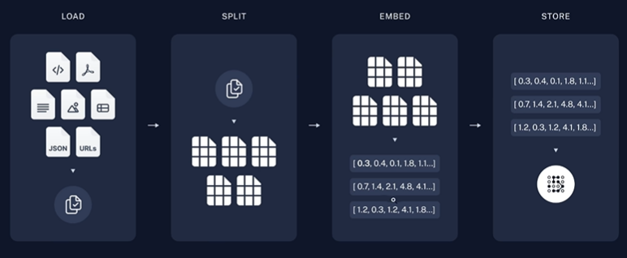

### RAG
- **检索增强生成（RAG）是指对大型语言模型输出进行优化，使其能够在生成响应之前引用训练数据来源之外的权威知识库。**
- 大型语言模型（LLM）用海量数据进行训练，使用数十亿个参数为回答问题、翻译语言和完成句子等任务生成原始输出。在 LLM 本就强大的功能基础上，**RAG 将其扩展为能访问特定领域或组织的内部知识库，所有这些都无需重新训练模型。这是一种经济高效地改进 LLM 输出的方法，让它在各种情境下都能保持相关性、准确性和实用性。**

#### RAG项目实战
- 检索系统，构造n个q-a对，基于考试的q来查询a
- 将书的知识进行切片（建成一个索引，按页、段落、章节切片均可），入到向量库里面，将query进行embedding，与向量库中存储的embedding相似度匹配，取top-k个，拿到上下文，再进行排序，基于query和上下文进行增强再灌给大模型

- langchain向量库切片
- 面对大模型的开发框架 langchain

### agent