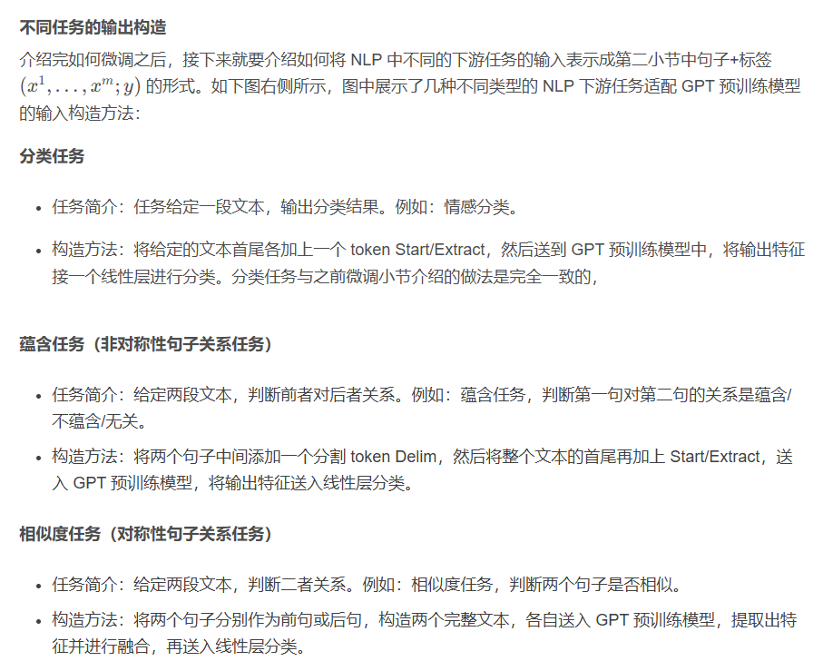
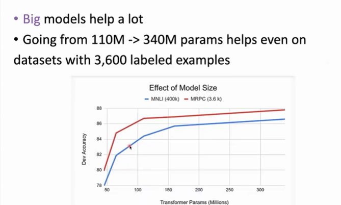

## 预训练语言模型 PLM
### 1. LM 的优势
- 回顾语言模型定义
    - 给定一句话，给定前面的词来预测下一个词 --> 条件概率

- **不需要人工标注**

- **LM很容易迁移到其他NLP任务，不只是根据前文预测下一个词**

- **Transformer之前NLP模型都以词向量作为输入**  
    - Word2Vec作为一个语言模型，可以在短时间内利用大量语料来学习一个比较好的词向量，这个词向量可以作为**下游任务各种NLP模型的输入**

### 2. 预训练范式
- **预训练的目的就是非常容易地迁移到各种下游任务**

- **两种范式**
    - **feature-based**
        - **在大规模的语料上预训练好模型参数，把语言模型产生的编码表示作为一个固定的feature，来交给下游模型**，如Word2Vec的词向量
    - **fine-tuning**
        - 下游任务的模型仍然是语言模型，使用相应下游任务的数据集对整个模型的参数进行更新，如BERT

### 3. GPT (Generative Pre-Training)
- GPT模型是一种**基于神经网络的自回归语言模型。GPT使用了Transformer的解码器decoder部分，能够在处理长序列数据时避免传统的 RNN 中存在的梯度消失问题**。

#### GPT-1

- 基于Transformer架构，GPT1可以在处理自然语言时**捕捉长距离依赖性，并且具有高效的并行性。**
- **预训练任务**
    - 预训练阶段，**GPT 的任务是标准语言模型的目标函数，即根据句子中前 k 个词，预测下一个词**。目标函数公式化表示为**最大化下面这个对数似然**：

    - 在预测下一个词时，**decoder的masked self-attention模块将当前词之后的词全部 mask 掉，模型只能根据当前词及其之前的词来进行预测**。而在编码器可以看到序列中的全部词。
    

- **微调阶段**
    
    

#### GPT-2
- 与GPT-1模型不同之处在于，GPT-2模型使用了**更大的模型规模和更多的数据进行预训练**
- 语言模型的评价指标 —— PPL困惑度，越低代表LM对文本的流畅程度打分越好，对LM的评价

- **zero-shot** 
    - 模型在预训练完成之后**不需要任何下游任务的标注数据来进行微调，而是直接进行预测**。
    - 将很多种**NLP任务用语言模型的形式将他们统一**，可以实现在没用任何标注数据的情况下，自回归完成任务

#### GPT-3
- **few shot / in-context learning**
    - 在任务设定上，GPT-3 没有固守于 GPT-2 的 zero-shot 方式，而是采用了 few-shot 的任务设定，即给出下游任务的一两个例子，然后要求模型对该任务的新问题给出预测。
    - **没有针对下游任务做任何的参数更新，通过语言模型自回归地去生成来完成任务**

#### InstructGPT
- **RLHF**
    - InstructGPT使用**来自人类反馈的强化学习方案RLHF**(reinforcement learning from human feedback)，通过对大语言模型进行微调，从而能够在参数减少的情况下，实现优于GPT-3的功能。
    
- **具体过程**
    - 根据RHLF，**训练出奖励模型(reward model)去训练学习模型**(即：用AI训练AI的思路)

    - 定义指令：首先，定义指令集合，即人类需要模型生成的语言指令。这些指令通常是任务相关的，例如完成一项任务或回答某个问题。

    - 生成指令：通过 InstructGPT 生成一个或多个备选指令，每个指令都对应一个相应的生成概率。这些备选指令会显示在屏幕上供人类评估。

    - 人类反馈：人类对生成的备选指令进行评估，并提供一个奖励信号，表示该指令与预期指令的匹配程度。奖励信号可以表示为基于 BLEU、ROUGE 等指标的分数。

    - 强化学习训练：根据人类反馈，训练模型以优化生成指令的质量。具体来说，使用强化学习算法，将生成的指令和人类反馈作为训练数据，迭代训练模型，以最大化生成指令的奖励信号。

- 该方法的优点是可**以让语言模型更加有针对性地生成文本，以适应特定任务或场景，并且可以根据人类反馈进行动态调整，提高生成文本的质量和多样性。**
 

### 4. T5
- **基于 encoder-decoder**
- **将所有的NLP任务统一成一个text-to-text的形式**，最大程度发挥tranfer learning
- 输入都是任务描述+任务内容

 

### 5. BERT (Bidirectional Encoder Representations from Transformers)
#### 起源
- **Transformer的decoder中使用的是masked self-attention，是left-to-right，无法看到未来的输入，而encoder中的self-attention本来就是双向的**，对于输入的完整的句子，他会使句子中的每个单词之间都产生联系

 

#### 预训练任务
- 在预训练时，BERT有**两个优化目标，一个是预测被MASK的词原来是什么，还有是预测输入的两个句子是否属于上下文关系。**
 

- **Input**
    - 为了使BERT能够更好的适应下游的任务，**理解句子之间的关系，输入是两个句子（句子对），这两个句子可能是上下文的，也可能不是上下文的**
    - 每对句子的开头都有一个[cls]符号，同时中间使用[sep]符号分割两个句子。[cls]符号被看作是一个特殊的符号，**在进行自注意力计算的时候[cls]融合了所有输入的信息**，因此在作分类任务的时候可以将[cls]作为整个输入提取特征后的代表，把[cls]通过全连接层再softmax操作得到最终的分类结果。
    - **token embedding**
        - 采用**wordpiece分词**方式
    - **segment embedding**
        - 告诉模型哪个token是第一个句子的，哪个token是第二个句子的，在**NSP预训练**任务中使用到
    - **position embedding**
        - **预定512个position token，随机初始化，训练的时候学习每个token的表示（可学习的），最大处理512长度**

 

- **Masked LM** 词与词之间的条件概率
    - BERT会对输入中的15%的句子随机打上Mask，然后让模型根据上下文信息预测被Mask的单词一开始是什么，相当于让模型去**完型填空**。
        - Mask比例过低，受到的监督信号就会很少，预训练的时间变长
        - Mask比例过高，文本中能利用的信息就很少，不足以还原原始单词

    - **但是在进行下游任务的微调时，输入里不会有[mask]这个符号，造成预训练和fine-tuning阶段有比较大的输入差异**，降低模型性能，导致模型只关注mask
    - 解决方法：**三种预训练策略**
        - 通过这样的方式，使得**预训练和微调的时候输入可以产生匹配。如果输入中没有[mask]符号，模型不会知道到底哪一个词是mask的，促使模型去对每一个词进行语境上的双向理解猜测**，同时又因为**只有很少的比例没有[mask]标识，因而在预训练的时候不会影响模型的收敛。**

 

- **Next Sentence Prediction** 学习句子之间的关系
    - **由于很多下游任务例如问答是基于理解两个句子之间的关系，而不是直接让模型去猜测**，因此BERT中还设计了第二个训练任务：**预测两个句子在文中是否是属于上下文的关系**。
    
    - 通过增加Next Sentence Prediction任务，可以使模型在问答和自然语言推理等下游任务上的能力提高。**输入的两个句子中有50%的概率是属于上下文关系，50%的概率不是属于上下文关系，因此这个任务又是一个二分类任务**。例如：
    - **输入中的[CLS]符号在经过编码后得到C，C可以看作是汇集了整个句子的所有信息**，因此将C经过MLP后得到最终二分类的输出，然后去算Loss。

- **BERT问题**
    - 预训练和下游任务可可能存在比较大的gap
    - 预训练效率低，只预测15%的词
    

### 6. RoBERTa
- **模型规模、算力和数据的改进**
    - 更大的模型参数量
    - 更大的batch_size
    - 更多的训练数据
- **预训练方法的改进**
    - 去掉NSP任务
    - 动态掩码
        - **BERT 在数据预处理期间执行一次掩码，得到一个静态掩码**。而 **RoBERTa 使用了动态掩码：每次向模型输入一个序列时都会生成新的掩码模式**。这样，在大量数据不断输入的过程中，**模型会逐渐适应不同的掩码策略，学习不同的语言表征。**
    - 文本编码

- 所有的词都受到了有效的监督
- 下游任务真正会用到的模型只是discriminator，没有收到mask 的影响 

